# Getting started with range42

> **⚠ Draft v0.1 - work in progress.**
> This document aims to be the canonical onboarding guide. Screenshots and steps
> may be incomplete. Open an issue or PR for any inaccuracy.

---

## Table of contents

- [What you'll deploy](#what-youll-deploy)
- [Prerequisites](#prerequisites)
- [Walkthrough - wizard steps](#walkthrough---wizard-steps)
  - [Step 0 - Clone the main repo](#step-0---clone-the-main-repo)
  - [Step 1 - Launch the wizard (preflight)](#step-1---launch-the-wizard-preflight)
  - [Step 1b - Confirm install paths](#step-1b---confirm-install-paths)
  - [Step 2 - Choose new or existing](#step-2---choose-new-or-existing)
  - [Step 3 - Enter your infrastructure codename](#step-3---enter-your-infrastructure-codename)
  - [Step 4 - Proxmox connection details](#step-4---proxmox-connection-details)
    - [The PVE node name must be exact](#the-pve-node-name-must-be-exact)
    - [Proxmox root password](#proxmox-root-password)
    - [Deployer-cli sudo password](#deployer-cli-sudo-password)
  - [Step 5 - Network (SDN or legacy mode, NAT per network)](#step-5---network-sdn-or-legacy-mode-nat-per-network)
    - [Disable outgoing NAT on a specific network](#disable-outgoing-nat-on-a-specific-network)
    - [Why the twelve networks are created at init](#why-the-twelve-networks-are-created-at-init)
  - [Step 6 - Pick scenario](#step-6---pick-scenario)
  - [Step 6b - VM firewall, ssh sources (optional)](#step-6b---vm-firewall-ssh-sources-optional)
  - [Step 7 - Deployer + auto-deploy](#step-7---deployer--auto-deploy)
    - [Deployer-cli location (IP)](#deployer-cli-location-ip)
    - [Deployer-cli user](#deployer-cli-user)
    - [Confirm and trigger the deployer-cli install](#confirm-and-trigger-the-deployer-cli-install)
    - [Auto-deploy starts](#auto-deploy-starts)
  - [Step 8 - Deploy the scenario itself](#step-8---deploy-the-scenario-itself)
    - [8a. Load your context](#8a-load-your-context)
    - [8b. Deploy the scenario VMs](#8b-deploy-the-scenario-vms)
- [What you can do after deploy](#what-you-can-do-after-deploy)
  - [Using range42-context](#using-range42-context)
    - [List configured contexts](#list-configured-contexts)
    - [Use a configured context](#use-a-configured-context)
    - [Show the current context](#show-the-current-context)
    - [Inventory](#inventory)
    - [Try a single catalog element](#try-a-single-catalog-element)
    - [SSH into deployed VMs](#ssh-into-deployed-vms)
    - [Initialise a new context](#initialise-a-new-context)
    - [Overwrite an existing configuration](#overwrite-an-existing-configuration)
    - [Deploy / undeploy](#deploy--undeploy)
    - [Reload SSH keys](#reload-ssh-keys)
    - [Networks and firewall](#networks-and-firewall)
    - [Full command list](#full-command-list)
  - [Where credentials live](#where-credentials-live)
    - [Workspace layout](#workspace-layout)
    - [Where is the vault password](#where-is-the-vault-password)
    - [How to view the vault contents](#how-to-view-the-vault-contents)
    - [I lost my Proxmox root password](#i-lost-my-proxmox-root-password)
    - [I lost my SSH keys for the VMs](#i-lost-my-ssh-keys-for-the-vms)
    - [I want to back up everything](#i-want-to-back-up-everything)
- [Updating range42](#updating-range42)
- [Troubleshooting](#troubleshooting)
- [Project structure](#project-structure)
- [Manual setup (advanced)](#manual-setup-advanced)
- [Extend the scenarios](#extend-the-scenarios)
- [Quick glossary](#quick-glossary)

---

## What you'll deploy

This guide walks through deploying `blank_scenario_2_subnets` - a minimal network lab with 4 Linux VMs across 2 subnets.

### What is a "blank scenario"?

It's not really a "scenario" in the classical sense (e.g., a CTF, a SIEM lab).
It's a **clean working base**: a few empty Ubuntu VMs across isolated subnets,
ready for you to install whatever you want on top - services, workloads,
training material, attack/defense exercises.

Think of it as a **starter kit** - a working network of VMs ready in ~20 minutes,
then yours to populate with whatever services, workloads, or training material
you want on top.

range42 ships 3 blank scenarios:
- `blank_scenario_2_subnets` - 2 subnets, 4 VMs (this guide)
- `blank_scenario_4_subnets` - 4 subnets, 16 VMs
- `blank_scenario_6_subnets` - 6 subnets, 24 VMs

For a full SIEM + CTF cyber range, see `demo_lab` instead. For one product at a time (MISP, Gitea, Mattermost, Nextcloud, Rocket.Chat, the Kunai detection workshop), see the `<product>_lab` scenarios.

All scenarios live in [range42-playbooks/scenarios](https://github.com/range42/range42-playbooks/tree/main/scenarios) - the list will grow over time. See [Extend the scenarios](#extend-the-scenarios) at the end of this guide for how to request new ones.

### Prerequisites for this guide

- A Proxmox VE 8.x server you can reach (the SDN networks the init creates by default are part of the core since 8.1 ; on 7.x SDN is an experimental add-on)
- Linux operator machine with Python 3.10+
- ~25 minutes of your time (mostly automated)

When done, you'll have:

```
   ┌─────────────────────┐                     ┌──────────────────────────────────┐
   │   deployer-cli      │                     │           Proxmox VE             │
   │   (your machine)    │  ──── SSH/API ────▶ │          (ip_forward=1)          │
   │   range42-context   │                     │                                  │
   └─────────────────────┘                     │  ┌────────┐                      │
                                               │  │ vmbr0  │  → internet (NAT)    │
                                               │  └────────┘                      │
                                               │                                  │
                                               │  ┌─────────────────────────────┐ │
                                               │  │ net143   192.168.143.0/24   │ │
                                               │  │   ├─ bs2-team-143-01  .200  │ │
                                               │  │   └─ bs2-team-143-02  .201  │ │
                                               │  └─────────────────────────────┘ │
                                               │                                  │
                                               │  ┌─────────────────────────────┐ │
                                               │  │ net144   192.168.144.0/24   │ │
                                               │  │   ├─ bs2-team-144-01  .200  │ │
                                               │  │   └─ bs2-team-144-02  .201  │ │
                                               │  └─────────────────────────────┘ │
                                               └──────────────────────────────────┘
```

You SSH into VMs via the Proxmox jump host:

```
deployer-cli  ──ssh──▶  Proxmox jump_user  ──ProxyJump──▶  bs2-team-XXX-XX
```

---

## Prerequisites

### On your local machine (operator workstation)

- Linux:
  - **Ubuntu LTS Desktop or Server (24.04)** — primary supported platform, what we develop and test on
  - **Debian 13** — also expected to work (less extensively tested)
  - Other distros may work but are not officially supported
- Python 3.10+
- `python3-bcrypt` (required to generate passphrase-protected ed25519 SSH keys ; the wizard preflight detects it and offers an Install button if missing, but you can pre-install with `sudo apt install python3-bcrypt`)
- Network access to your Proxmox (see ports below)

### On the Proxmox server

- One physical interface with internet access (e.g., `vmbr0`)
- Root SSH access enabled (the wizard will install a key automatically)
- Storage `local-lvm` available

### Network ports - operator → Proxmox

The wizard and `range42-context` need these open from your operator machine to the Proxmox host:

| Port | Protocol | Used for |
|------|----------|----------|
| 22 | TCP | SSH (root for bootstrap, jump_user for ProxyJump after) |
| 8006 | HTTPS | Proxmox API (VM lifecycle, network config, etc.) |


If you're behind a firewall, allow at least 22 + 8006. 


### Optional — local apt proxy

If you have a local apt cache (apt-cacher-ng, Squid, etc.), the wizard's
**step 0** lets you provide its URL. When set, range42 plumbs the proxy through
three layers automatically:

- **deployer-cli** (`/etc/apt/apt.conf.d/00range42-proxy`) — applied by
  `deployer.bootstrap` before any apt install
- **Proxmox host** — a cloud-init snippet is dropped at
  `/var/lib/vz/snippets/range42-apt-proxy.yaml` by `proxmox.init`
- **lab VMs** — the snippet is attached as cloud-init `vendor-data` on every
  VM template (`qm set <id> --cicustom vendor=...`); all clones inherit the
  proxy at first boot

Format expected: `http(s)://host:port` (e.g. `http://192.168.1.50:3142` for
apt-cacher-ng's default port). The wizard validates the format and runs a
reachability check before letting you proceed.

Leave the field empty in the wizard if you don't have a proxy — everything
works without it, just slower on apt-heavy installs.

---

## Walkthrough - wizard steps

For each step you'll see:
- **Screenshot** of the wizard at this step (placeholder for now)
- **What you do** - what to enter / click
- **Behind the scenes** - what the wizard does on your machine and on Proxmox

### Step 0 - Clone the main repo

You only need the `range42` repo locally — it contains the wizard. The wizard
itself will clone the rest (playbooks, catalog, controller, devkit) on the
deployer-cli during deploy.

```bash
sudo apt-get update ; apt-get upgrade -y
sudo apt-get install python3-venv git
mkdir -p $HOME/range42 && cd $HOME/range42
git clone https://github.com/range42/range42.git
```

> **Recommended:** keep the default paths (`$HOME/range42` for git repos,
> `$HOME/range42.config` for workspaces). The wizard offers to change them
> if you really need to, but the defaults are well-tested and many scripts /
> configs reference them. **This is the only structural constraint** — the
> rest of the wizard is fully configurable.

### Step 1 - Launch the wizard (preflight)

```bash
cd ~/range42/range42
./range42-init.py
```


**What you do:** wait for the preflight checks. If anything is missing,
the wizard offers to install it (textual, ansible, sshpass, keychain).

**Behind the scenes:**
- Checks `which ansible ssh-keygen ssh-agent sshpass git keychain zsh`
- Checks Ansible collections: `community.crypto`, `community.general`
- Checks if `inventories/example/` exists
- Checks ssh-agent is running

If anything is missing, the wizard either auto-installs (apt) or shows the
fix command for you to run manually.

### Step 1b - Confirm install paths

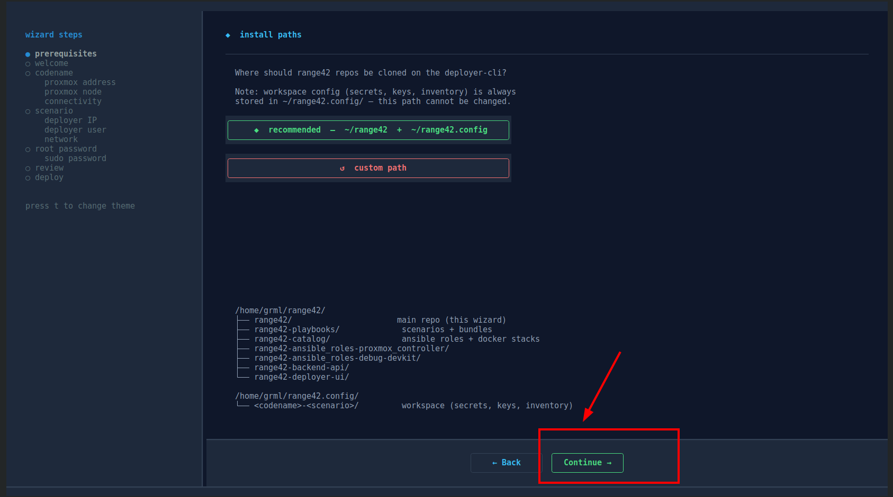

**What you do:** review the install paths and confirm.

The wizard asks where to put two things:
- **range42 git repos** → default: `$HOME/range42/`
- **range42 workspaces** (per-codename configs, secrets, SSH keys) → default: `$HOME/range42.config/`

**Recommended: keep the defaults.** Changing them is possible but it is one of
the **rare elements we recommend not to modify** — many internal scripts,
templates and helper functions reference these paths, and a non-default layout
can make troubleshooting harder.

**Behind the scenes:**
- The chosen paths are stored in the wizard config and propagated to:
  - `inventories/<codename>/group_vars/all/vars.yml`
  - `~/range42.config/<codename>-<scenario>/sourced_range42.sh`
  - SSH config templates, vault paths, devkit scripts

### Step 2 - Choose new or existing

What you see at this step depends on whether you've already deployed range42 on this machine.

**First-time setup** — no previous configuration is detected, the wizard goes straight to "new":

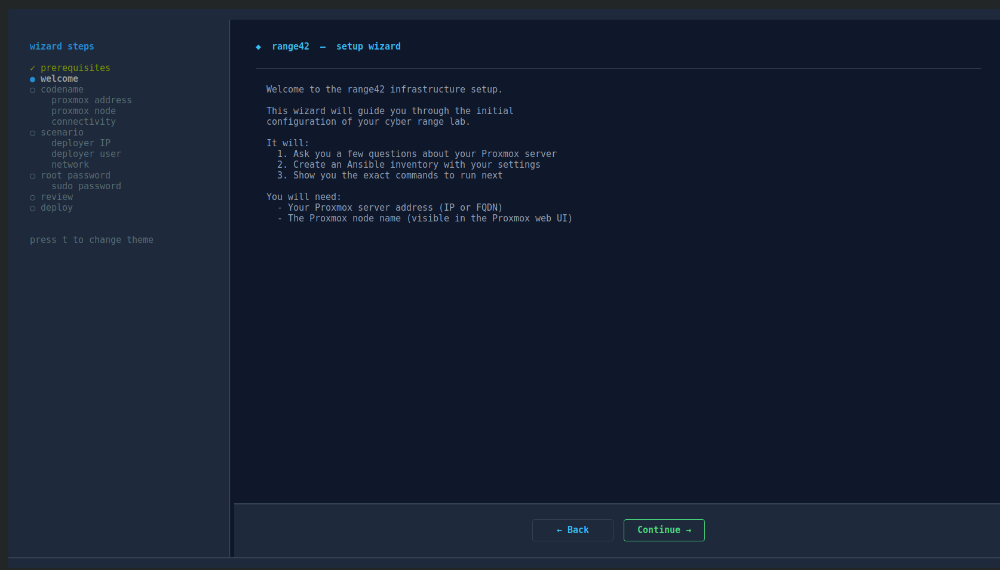

**Subsequent runs** — at least one previous configuration exists, the wizard offers a choice:

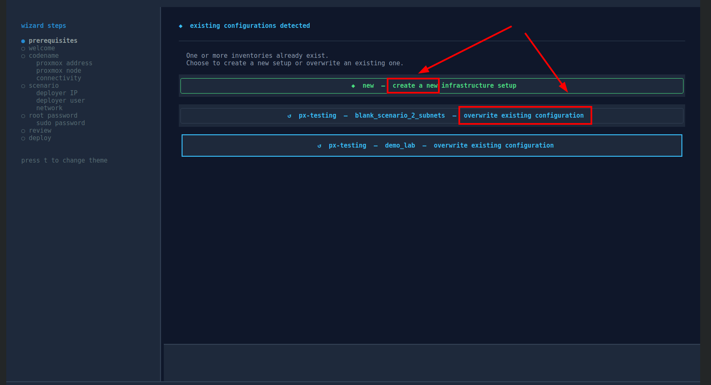

**What you do:** first-time setup → nothing to pick, just continue. If you already deployed a config, you'll see it listed and can either start a new one or overwrite an existing one.

**Behind the scenes:**
- Scans `inventories/` for existing setups (folders with `hosts.yml`)
- For each, parses `group_vars/` to detect deployed scenarios
- Shows one button per `codename + scenario` combination, plus `◆ new`

If you pick "new", an empty inventory will be created. If you pick an existing one, the wizard pre-fills all fields from `group_vars/all/vars.yml`.

### Step 3 - Enter your infrastructure codename


**What you do:** pick a label for your Proxmox infrastructure (e.g., `mylab`).
This becomes the namespace for everything related to this Proxmox.

**Behind the scenes:**
- Will create `inventories/<codename>/` from `inventories/example/` template
- All subsequent files (vault, SSH keys, workspace) are scoped under this codename

### Step 4 - Proxmox connection details


**What you do:**
- **Address**: IP or hostname of your Proxmox (e.g., `192.168.1.10`)
- **Node**: Proxmox node name (see below)

#### The PVE node name must be exact

The wizard asks for the **Proxmox node name**. This is **not** a label you choose - it must match exactly the node name as it appears in the Proxmox web UI / API. Often it's `pve` on a single-node setup, but it can also be `pve01`, the hostname, or anything the cluster admin set.

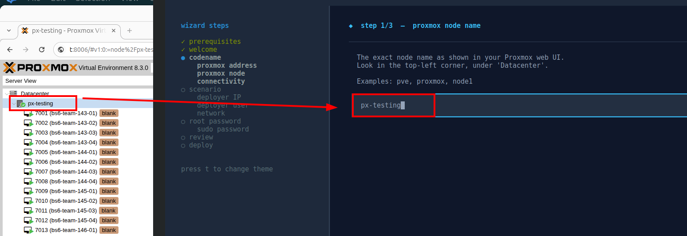

You can find the exact name in the Proxmox web console (left sidebar tree, the entry under "Datacenter") or via SSH on the Proxmox host: `pvesh get /nodes --output-format json | jq -r '.[].node'`.

If the name doesn't match exactly, the wizard's API calls will fail at Step 4 validation (or later at deploy time on `vm_create`).

**Behind the scenes:**
- Tests HTTPS reachability to `https://<address>:8006`
- Validates the node name exists in Proxmox API (`GET /nodes`)

No changes are made yet - this is read-only verification.

#### Proxmox root password

The wizard then prompts for the Proxmox **root password**.

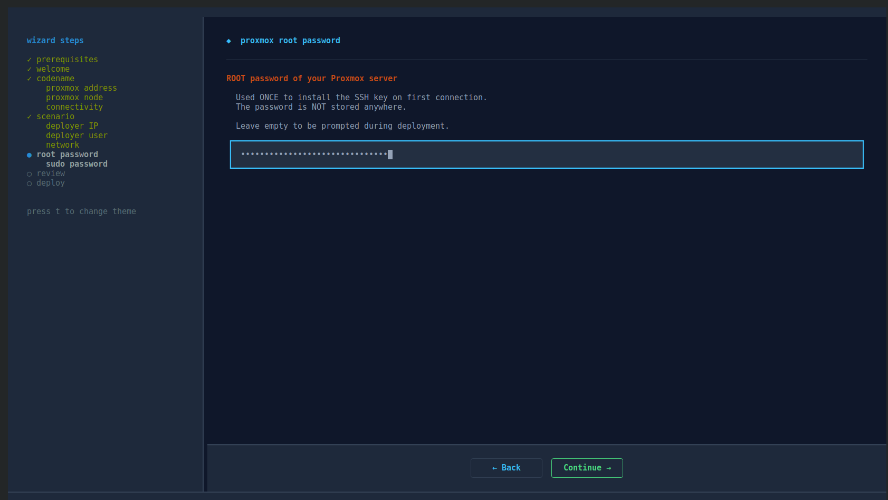

**What it's used for:**
- Install the range42 root SSH key in `/root/.ssh/authorized_keys` (one-shot, via `sshpass`)
- Create the `jump_user` Linux account on Proxmox
- Create the `range42_api` PAM user + API token via `pveum`
- Configure Proxmox locale, NTP and IP forwarding (and, in legacy mode only, the `vmbr` bridges with their NAT) ; the SDN networks of the default mode are created afterwards through the API token, by playbook 04

After this bootstrap, root SSH is no longer used — daily operations go through the `jump_user` and the API token (see [Why a `jump_user` and not just root?](#why-a-jump_user-and-not-just-root) below).

**Privacy note:** the password is held in memory by the wizard for the duration of the run and never written to disk.

#### Deployer-cli sudo password

The wizard also prompts for the **sudo password on the deployer-cli** (your local machine in the default setup).

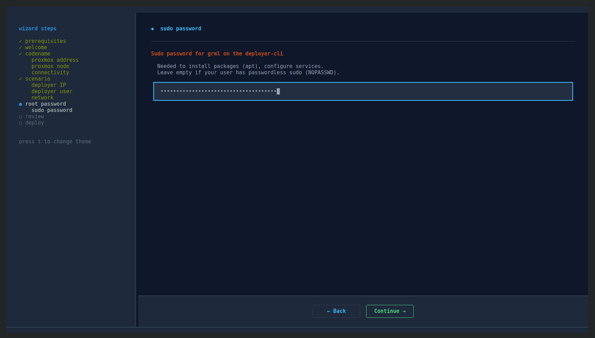

**What it's used for:**
- `apt install` packages required by the deployer-cli role (ansible, git, keychain, zsh, sshpass, etc.)
- Install dotfiles and configure system services (locale, NTP)
- Write SSH config under `~/.ssh/` (no sudo strictly needed for `~/.ssh`, but other steps in the role need it)

If the deployer-cli is your local machine (the default), this is your own sudo password. If you target a remote deployer-cli VM, this is the sudo password of the user on that VM.

### Step 5 - Network (SDN or legacy mode, NAT per network)


**What you do:**
- The wizard auto-detects your outbound NAT interface (typically `vmbr0`) and asks you to confirm it
- It then asks for the **network mode** : **SDN networks** (recommended, the default) or **legacy vmbr bridges** (unsupported, kept for a private scenario that was never migrated ; the new scenarios do not run on it)
- The twelve lab networks are listed with an outbound NAT toggle each : `net140` to `net151` in SDN mode, `vmbr140` to `vmbr151` in legacy mode
- Defaults are fine - accept

In SDN mode the lab networks are Proxmox SDN objects : one zone (`r42zone` by default) holding one vnet per lab network, each with its subnet and its gateway (`net143` carries `192.168.143.0/24`, gateway `.1`). The zone is host-local : the Proxmox host holds the gateway of every subnet and routes between them, and outbound internet comes from the SNAT rule of the subnet, not from the physical network knowing these ranges exist.

#### Disable outgoing NAT on a specific network

If you want to **isolate one or several subnets from internet access**, click the corresponding network in the list to toggle off its outbound NAT.

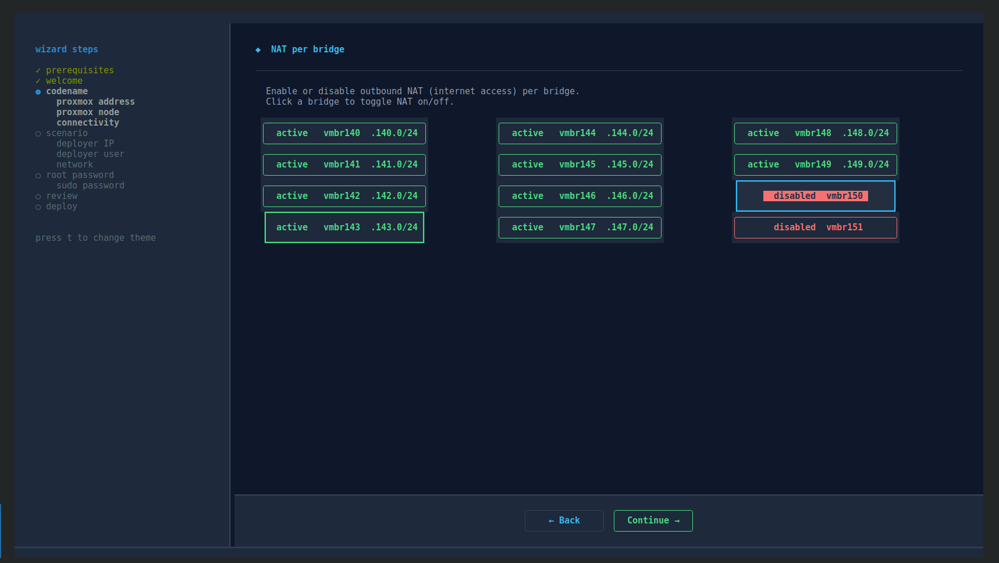

This is useful for fully air-gapped subnets (e.g., a sensitive forensic VM, an offline analysis lab) - VMs on a NAT-disabled network can still talk to the other VMs, but cannot reach the internet through the Proxmox host. Keep `net140` on : it is the templating network, the template builds run `apt` there.

The choice made here is the declaration that counts : it goes to the inventory (`range42_sdn_networks`, section NETWORK MODE of `group_vars/all/vars.yml`) and travels to the deployer-cli through the vault. Every deployment and every `range42-context networks-apply` puts the networks back to this declaration, so a `range42-context networks-internet-off` played later is a temporary gesture ; a durable change is made here, or in the inventory, then re-init with overwrite.

#### Why the twelve networks are created at init

range42 **creates all twelve lab networks at init**, even if your scenario only uses a few of them.

**Why:** a vnet name is global to the cluster and several scenarios share the same networks (`net142` alone is the admin network of about fifteen scenarios). Creating them once, idempotently, means deploying any scenario, or adding one with more subnets, needs no Proxmox network reconfiguration later. Each scenario still declares the networks it uses in its `00_sdn_bootstrap/_main.yml`, and its deployment creates what would be missing, never deletes anything.

**Behind the scenes:**
- SSH to Proxmox as root, runs `ip route get 1.1.1.1 | awk '{print $5}'` to identify the outbound interface (typically `vmbr0`)
- SDN mode : after `site.yml`, the playbook `04_configure_sdn.yml` creates the zone, the vnets and their subnets through the Proxmox API (bundle `sdn_network.bootstrap` of range42-playbooks), applies once and waits for the task, then reconciles the live SNAT rules to the declaration (idempotent - a conforming host is a no-op)
- Legacy mode : creates the `vmbr140-151` bridges via `pvesh create /nodes/<node>/network` with per-bridge NAT rules, then `ifreload -a`
- Stores in inventory:
  - `infrastructure_proxmox_default_network_card_interface: vmbr0`
  - `INIT_LEGACY_BRIDGES: "NO"` (SDN, the default) or `"YES"` (legacy), `range42_sdn_zone`, and the per-network `snat: true/false` list `range42_sdn_networks`

A host that moves from the legacy bridges to SDN runs `range42-context networks-legacy-clean` once (a bridge and a vnet cannot both carry the same `.1`, and the failure is a silent `No route to host`), then re-inits. See the README of any scenario, section "Migrating from the bridge-based scenarios".

### Step 6 - Pick scenario


**What you do:** pick `blank_scenario_2_subnets` in the list.

Only complete scenarios are listed : a directory of `range42-playbooks/scenarios/` that carries a `manifest/scenario_vms.json` and the four template files (`templates/ansible-inventory.j2`, `ansible-vars.yml`, `ssh-config.j2`, `vault-example.yml`). A directory whose name starts with an underscore is a placeholder and is never listed. The wizard warns when the scenario's network kind does not match the mode chosen at step 5.

**Behind the scenes:**
- Stored as `INFRASTRUCTURE_SCENARIO` in `group_vars/all/vars.yml`
- Determines which J2 templates the deploy will use

### Step 6b - VM firewall, ssh sources (optional)

**Off by default - skip it unless you need it.** This step restricts who may reach port 22 of the lab VMs.

**Where the rule lives:** in the **Proxmox firewall of each VM** (hypervisor side, on the VM's network card, in force once the guest is armed). It is **not** the firewall inside the VMs (ufw), which this step never touches.

- Switch **off** (default) : the ssh accept the deployment declares on every VM stays open to any source, as always.
- Switch **on** : type IPv4 addresses (`a.b.c.d` or `a.b.c.d/32`, comma or space separated). The accept is then restricted to those addresses **plus every network of the scenario**, always added : the deployer reaches the VMs through the Proxmox jump host, so a VM sees the host's address, not yours, and the lab VMs keep reaching each other. Only the outside is filtered.

**Behind the scenes:**
- Stored as `range42_fw_vm_ssh_sources` (a list) in `group_vars/all/vars.yml`, carried to the workspace by the vault
- Read by the `firewall.baseline.ssh_all_vms` bundle at every deployment ; applies to the VMs the workspace creates (an accept already open on a VM is not tightened afterwards)
- Inert until the guest is armed : `FIREWALL_ARM_VMS=YES` at deploy, or `range42-context networks-firewall-on` later

### Step 7 - Deployer + auto-deploy

This step asks **where** the deployer-cli will run (location + user) and then launches the full deployment. The two passwords (Proxmox root + deployer-cli sudo) were already collected at [Step 4](#step-4---proxmox-connection-details).

#### Deployer-cli location (IP)

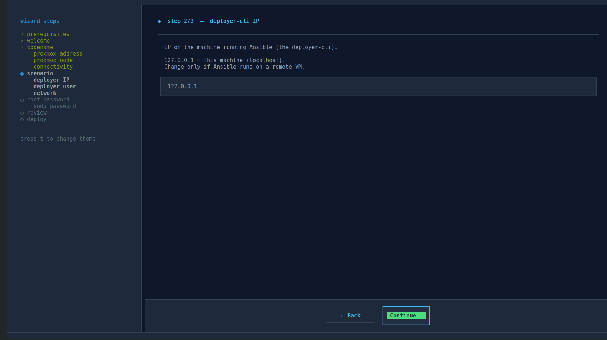

**What you do:** enter the IP / hostname where the deployer-cli will be configured.

**By default, range42 deploys the deployer-cli on the same machine where you run the wizard** — so the default value is `127.0.0.1`. Most users keep this.

If you want a dedicated deployer-cli VM (e.g., to manage multiple Proxmox infrastructures from one place, or to keep credentials off your laptop), enter that VM's IP instead. The VM must already exist and be reachable over SSH.

#### Deployer-cli user

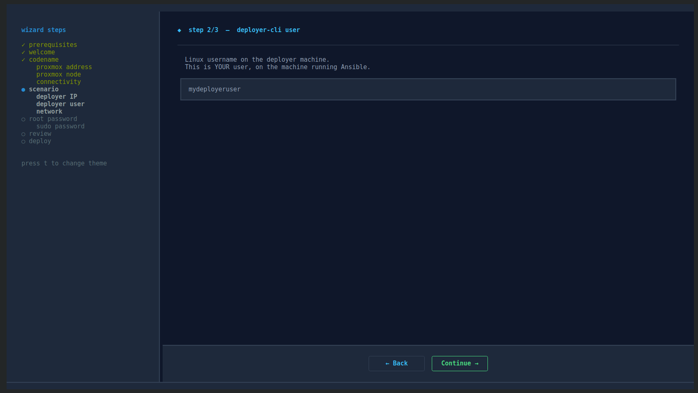

**What you do:** enter the Linux user that will own the workspace on the deployer-cli.

If you kept `127.0.0.1` above, this is your current local user (typically what `whoami` returns). On a dedicated deployer-cli VM, this is the user that will hold `~/range42/`, `~/range42.config/`, `~/.ssh/range42/`, etc.

The user must:
- Already exist on the deployer-cli machine
- Have sudo rights (for the apt installs in Playbook 03)
- Be reachable over SSH from the wizard machine (only if you target a remote deployer-cli)

#### Confirm and trigger the deployer-cli install

This is the **last interactive prompt** — the wizard shows a recap of everything it's about to do (Proxmox address, codename, scenario, deployer-cli location/user, network mode and the NAT per network, VM ssh sources) and asks you to confirm before any change is made on Proxmox or on the deployer-cli.

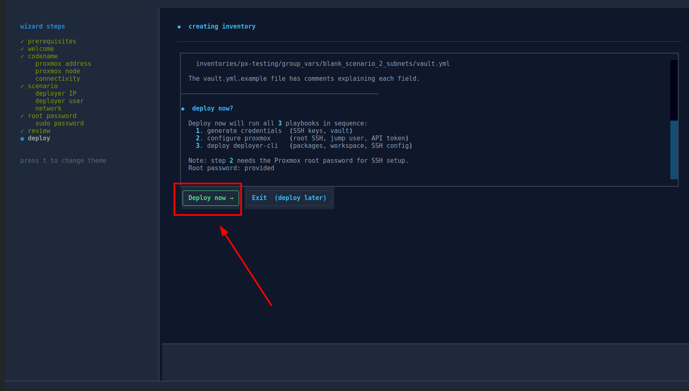

**What you do:** review the recap, then confirm to launch the install.

**Why a confirmation step:** up to here the wizard has only been **collecting input and doing read-only checks** (HTTPS reachability, node name validation). The moment you confirm, the wizard starts making real changes — installing SSH keys on Proxmox, creating the jump_user, generating the API token, writing the vault, configuring the deployer-cli. This is your last opportunity to abort cleanly.

If you abort here (Ctrl-C or "Cancel"), nothing has been touched on Proxmox or on the deployer-cli yet — your input is just discarded.

#### Auto-deploy starts

After confirming, the wizard runs the full deployment automatically (~10-15 min).

**Behind the scenes:** the wizard runs `ansible-playbook site.yml` which executes 3 playbooks in sequence, then a fourth one in SDN mode (the lab networks).

#### Playbook 01 - credentials.generate

**Local actions:**
- Generate 4 SSH keypairs (ed25519) in `config/<codename>-<scenario>/ssh_keys/`:
  - `px.<codename>-<scenario>-ssh_cli.root` - Proxmox root SSH
  - `px.<codename>-<scenario>-ssh_cli.jump_user` - Proxmox jump user SSH
  - `r42.<codename>-<scenario>-deployer-key_alice` - admin user on VMs
  - `r42.<codename>-<scenario>-student-key_bob` - student user on VMs
- Generate vault with random VM passwords + Wazuh password
- Encrypt vault with `vault_pass.txt`
- Generate operator's SSH config snippet

#### Playbook 02 - configure proxmox

**Proxmox actions (via root SSH using password from wizard):**
- Install the root SSH key in `/root/.ssh/authorized_keys`
- Create `jump_user` Linux user
- Install Linux locale (en_US.UTF-8)
- Configure NTP

**Proxmox actions (via API token, then via root SSH):**
- Create `range42_api` PAM user
- Generate `range42_api_token` token (auto-recovers if exists with wrong secret)
- Inject token secret into vault
- Enable IP forwarding
- Legacy mode only : create the `vmbr140` to `vmbr151` bridges via `pvesh`, inject their NAT rules (post-up/post-down iptables MASQUERADE), reload the network (`ifreload -a`). In SDN mode the lab networks come from playbook 04 below.

##### Why a `jump_user` and not just root?

You'll notice range42 creates a separate `jump_user` Linux account on Proxmox,
even though it already installed the root SSH key. Two reasons:

1. **Separation of concerns.** Root is used **only once** during bootstrap
   (install the root key, create the jump user, set the API token). After that,
   day-to-day operations (`range42-context use`, `ssh r42.<vm>`) use the API token
   and `jump_user`. Root SSH is no longer needed.

2. **Reduced attack surface for ProxyJump.** A SSH connection through a `jump_user`
   only needs to forward TCP to the internal subnets - it doesn't need a shell.
   Even if the jump key leaks, the attacker has no shell on Proxmox (you can lock
   the user down further with `ForceCommand` or restricted shell if desired).

   Honestly, this doesn't add a huge amount of security on its own - the `jump_user`
   on Proxmox is still a Linux account. But it's a good hygiene practice and lets
   you rotate the jump key without touching root.

#### Playbook 03 - deploy deployer-cli

**Deployer-cli actions (via SSH from your local machine):**
- Install packages: `ansible`, `git`, `keychain`, `oh-my-zsh`, `zsh`, `vim`, etc.
- Configure NTP and locale
- Install dotfiles (vim, zsh)
- Clone all 5 range42 repos to `~/range42/` (see table below)
- Create workspace at `~/range42.config/<codename>-<scenario>/`
- Upload SSH keys + vault from local machine
- Create symlinks: `scenario →` (in workspace), `secrets →` (in playbook scenario dir)
- Generate two SSH config files from J2 templates:
  - `~/.ssh/config` - adds `Include` for the next file
  - `~/.ssh/config_range42-<codename>-<scenario>` - actual host entries
- Inject `source ~/range42.config/range42-context.sh` into `.zshrc`
- Set the active context to this codename + scenario

After this, `range42-context init` switches your shell to the workspace for you: it runs `range42-context use <codename> <scenario>` and prints that command in colour as it does, so the SSH keys, the vault and the environment are loaded without a manual step. `range42-context use` stays the command to switch again later or from another terminal.

#### Playbook 04 - configure sdn (SDN mode)

Run by the wizard once `site.yml` is through, because it reads the encrypted vault that playbook 01 creates. It creates the SDN zone and the twelve lab vnets with their subnets and their outbound NAT declaration through the Proxmox API (bundle `sdn_network.bootstrap` of range42-playbooks), applies once, waits for the task, then reconciles the live SNAT rules to the declaration. Idempotent : a conforming host is a no-op, and re-running it puts a host back in shape. `range42-context networks-apply` runs the same declaration for the active scenario later.

##### The 5 repos cloned on the deployer-cli

| Repo | Purpose |
|------|---------|
| `range42` | Main repo. Wizard, 13 Ansible roles, 4 playbooks (credentials, Proxmox, deployer-cli, SDN networks) plus a maintenance one, the `range42-context` and `range42-workspace` shell tools. |
| `range42-playbooks` | Lab scenarios (demo_lab, blank_scenario_*, the product labs) and the bundles they are made of. What gets deployed on the Proxmox VMs. |
| `range42-catalog` | Reusable Ansible roles (firewalls, packages, dotfiles, wazuh, etc.) used by scenarios. |
| `range42-ansible_roles-proxmox_controller` | Wraps the Proxmox API : VM lifecycle, templates and cloud-init, SDN networks, the hypervisor firewall, snapshots, storage. |
| `range42-ansible_roles-debug-devkit` | Helper scripts (json lines, pipeable) for VMs, snapshots and storage, and the API-first views and gestures behind `range42-context networks-*`. |

### Step 8 - Deploy the scenario itself

This isn't a wizard step - you run it manually after the wizard finishes.

#### 8a. Load your context

The init has already switched the shell it ran in to this workspace (you saw the `range42-context use ...` line it executed for you). In a new terminal, or to switch again, load the workspace yourself:

```bash
range42-context use YOUR_CODENAME_INFRASTRUCTURE blank_scenario_2_subnets
```

You should see `range42-context` switch into the workspace, with output like this:

```
----[ switching to px-testing-blank_scenario_2_subnets ]----

    ➜ commented all active Include lines
    ➜ uncommented Include for px-testing-blank_scenario_2_subnets
    ➜ commented all sourced_range42.sh in .zshrc
    ➜ uncommented sourced_range42.sh for px-testing-blank_scenario_2_subnets in .zshrc
    ➜ sourced /home/grml/range42.config/px-testing-blank_scenario_2_subnets/sourced_range42.sh
    ➜ updated secrets symlink in devkit → px-testing-blank_scenario_2_subnets
    ➜ updated secrets symlink in playbooks → px-testing-blank_scenario_2_subnets
    ➜ exported RANGE42_VAULT_PASSWORD_FILE=/home/grml/range42.config/px-testing-blank_scenario_2_subnets/secrets/vault_pass.txt
    ➜ exported ANSIBLE_CONFIG=/home/grml/range42/range42/ansible.cfg
    ✓ ssh keys reloaded (3 key(s) loaded)

    --- status : px-testing-blank_scenario_2_subnets ---

    workspace        px-testing-blank_scenario_2_subnets  ok
    vault pass       vault_pass.txt                       ok
    vault            encrypted                            ok
    vault decrypt    password valid                       ok
    ssh-agent        3 key(s) loaded                      ok
    inventory        inventory_default.yml                ok
    scenario         blank_scenario_2_subnets             ok
```

If every line of the status block ends with `ok`, the workspace is loaded correctly and you're ready to deploy. If anything is `ko`, see [Troubleshooting](#troubleshooting).

#### 8b. Deploy the scenario VMs

```bash
range42-context deploy    # ~15-20 min for first deploy
```

**Behind the scenes:**

1. Reads the hypervisor firewall switches and declares the anti-lockout accepts (ssh and the Proxmox API) on the datacenter and the node
2. Declares the scenario networks (`00_sdn_bootstrap/_main.yml` : `net140`, `net142`, `net143`, `net144`) and creates what is missing - never deletes, a vnet is shared between scenarios
3. Downloads the cloud-init images (Ubuntu Noble minimal and server, Debian 12, Alpine) to Proxmox storage
4. Builds the two VM templates this scenario whitelists (small-01 `9221`, medium-02 `9232`) on `net140`, the templating network, from the shared `template.build.ubuntu_noble` bundle
5. For each of the 4 team VMs:
   - Clones the template `9221` to a new VM
   - Sets cloud-init variables (user, password, SSH key, IP, gateway, network)
   - Starts the VM
   - Waits for SSH and cloud-init completion
6. Declares the ssh accept on every deployed VM in the Proxmox guest firewall (restricted to the sources of step 6b if you set any), inert until the guest is armed
7. On all 4 VMs:
   - Installs basic packages (vim, htop, net-utils)
   - Installs dotfiles for `alice` user
   - Configures UFW firewall inside the VM (port 22 only)
8. Arms the guest firewalls only if you asked for it : `range42-context deploy -e FIREWALL_ARM_VMS=YES`, or later `range42-context networks-firewall-on`

When deploy completes, SSH into a VM:

```bash
ssh r42.bs2-team-143-01
```

You're now `alice@bs2-team-143-01`. From here you can ping the other 3 VMs
(`192.168.143.201`, `192.168.144.200`, `192.168.144.201`) and reach the internet
(NAT routes through `vmbr0`).

> **Note:** range42 generated **both** the Ansible inventory and your `~/.ssh/config`
> for you. SSH keys are loaded automatically when you run `range42-context use`.
> No manual SSH key import or `-i keyfile` flag needed - just `ssh r42.<vm-name>`.

> **Next:** read [What you can do after deploy](#what-you-can-do-after-deploy)
> below for daily operations (range42-context, credentials, backup).

---

## What you can do after deploy

### Using range42-context

`range42-context` is the daily-use tool. It manages workspaces, switches between
infrastructures and scenarios, deploys/cleans up VMs, and reloads SSH keys.

It's a **shell function** (zsh), sourced from `~/.zshrc`. So `range42-context use`
modifies the current shell - no need to restart, no need to spawn subshells.

#### List configured contexts

> Lists all configured contexts (workspaces) on this deployer-cli, with the active one marked.

A workspace is a `codename + scenario` combination. After step 7 above, you have one.
After multiple `range42-context init` runs, you have several.

```
$ range42-context list

  ── available workspaces ──────────────────────────────────────
  ● [1]  mylab-blank_scenario_2_subnets       range42-context use mylab blank_scenario_2_subnets
  ○ [2]  mylab-demo_lab                       range42-context use mylab demo_lab
  ○ [3]  otherlab-blank_scenario_4_subnets    range42-context use otherlab blank_scenario_4_subnets
```

The active workspace is marked `●`. Inactive workspaces are `○`. The right
column shows the exact command to switch to that workspace.

#### Use a configured context

> Switches your shell to a configured context. SSH config, vault password,
> environment variables and prompt are all updated.

```
$ range42-context use mylab demo_lab

  ── switching context ────────────────────────────────────────
   ✓  workspace        : mylab-demo_lab
   ✓  vault password   : ~/range42.config/mylab-demo_lab/secrets/vault_pass.txt
   ✓  ssh keys loaded  : 4 keys
   ✓  ssh include      : ~/.ssh/config_range42-mylab-demo_lab
   ✓  prompt updated   : [mylab/demo_lab]
```

After this, all `range42-context` commands operate on the new workspace.

#### Show the current context

> Shows which context is currently active in your shell.

```
$ range42-context current
mylab-demo_lab
```

#### Inventory

Lists all hosts the active workspace will deploy:

```
$ range42-context show-inventory

@all:
  |--@range42_infrastructure:
  |  |--@r42_admin:
  |  |  |--r42.admin-wazuh
  |  |  |--r42.admin-deployer-api-gateway
  |  |  |--r42.admin-deployer-api-backend
  |  |  |--r42.admin-deployer-ui
  |  |--@r42_admin_wazuh_clients:
  |  |  |--r42.admin-deployer-api-gateway
  |  |  |--r42.admin-deployer-api-backend
  |  |  |--r42.admin-deployer-ui
  |  |--@r42_vuln_box_group:
  |  |  |--r42.vuln-box-00
  |  |  |--r42.vuln-box-01
  |  |  |--r42.vuln-box-02
  |  |  |--r42.vuln-box-03
  |  |  |--r42.vuln-box-04
  |  |--@proxmox:
  |  |  |--mylab
  |  |--@proxmox_cli:
  |  |  |--mylab-cli
```

Useful for sanity-checking what would be deployed before running `deploy`.

#### Try a single catalog element

For fast iteration on a single deployable element (Docker compose / Makefile)
from [range42-catalog](https://github.com/range42/range42-catalog) without
rebuilding a full lab, range42 ships a disposable-VM mode :

```bash
range42-context catalog-try-list                # browse available elements
range42-context catalog-try docker/_ctf/hello   # deploy + smoke-check one
```

`catalog-try` resolves the logical path, deploys the element on the
`catalog_try` VM, runs it, and smoke-checks it per the element's contract
(`catalog_try.yml` declaring L2 service / oneshot / L1 fallback). Each run
destroys + recreates the test VM, so iteration is fast and stateless. Admin
elements (Gitea, Mattermost, Nextcloud ...) are listed separately via
`catalog-try-list-admin`.

You can also bootstrap a fresh deployer-cli directly into this mode from your
laptop :

```bash
./range42-init.py --catalog-try docker/_ctf/hello
```

The wizard skips the scenario picker, forces `scenario=catalog_try`, and the
final banner suggests the right `range42-context catalog-try <path>` to run.

#### SSH into deployed VMs

`range42-context use` configures **two** things at once:
- Ansible inventory (for `range42-context deploy`)
- SSH config (for `ssh <hostname>` directly)

So once a workspace is active, you can SSH into any deployed VM by name:

```
$ ssh r42.bs2-team-143-01
alice@bs2-team-143-01:~$

$ ssh r42.admin-wazuh
alice@admin-wazuh:~$
```

The hostnames are defined in the auto-generated SSH config:
`~/.ssh/config_range42-<codename>-<scenario>` (included from `~/.ssh/config`).

VMs are on the lab networks (`net143`, `net144`, etc.), which are host-local - your operator machine
has no direct route to them. SSH uses **ProxyJump** through the Proxmox host:

```
   ┌─────────────────┐         ┌──────────────────────┐         ┌───────────────────────┐
   │  your machine   │  ssh    │  Proxmox             │  ssh    │  bs2-team-143-01      │
   │  (operator)     │ ──────▶ │  user: jump_user     │ ──────▶ │  user: alice          │
   │                 │         │  on internet bridge  │         │  on internal net143   │
   │  ssh key:       │         │                      │         │                       │
   │  jump_user key  │         │  (ProxyJump only,    │         │  ssh key:             │
   │  + alice key    │         │  no shell session)   │         │  alice key            │
   └─────────────────┘         └──────────────────────┘         └───────────────────────┘
```

Both keys are loaded into your ssh-agent by `range42-context use`. If they
disappear (after reboot), reload them:

```bash
range42-context ssh-reload
```

#### Initialise a new context

Use the wizard to add a new scenario or a new Proxmox infrastructure:

```bash
range42-context init
```

This launches `range42-init.py` again. From there you can:

- **Add a scenario to an existing codename** → pick the codename in step 2,
  then change the scenario in step 6 (e.g., switch from `blank_scenario_2_subnets`
  to `demo_lab`)
- **Add a new infrastructure (codename)** → pick "new" in step 2,
  enter a different codename in step 3

After init completes, the new workspace appears in `range42-context list`.

```
$ range42-context list

  ── available workspaces ──────────────────────────────────────
  ● [1]  mylab-blank_scenario_2_subnets       range42-context use mylab blank_scenario_2_subnets
  ○ [2]  mylab-demo_lab                       range42-context use mylab demo_lab    ← new
```

#### Overwrite an existing configuration

If you want to redo a configuration from scratch (wrong Proxmox address,
changed credentials, etc.) — re-run the wizard and pick the existing config
in step 2 instead of "new".

```bash
range42-context init
```

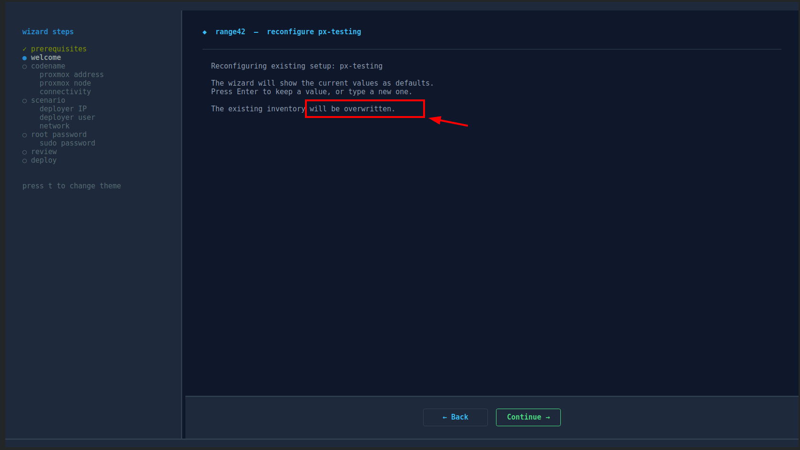

In step 2, you'll see all your configured contexts listed below `◆ new`.
Pick the one you want to overwrite — the wizard will pre-fill all the fields
from the existing config, so you only need to update what changed.

> ⚠️ Overwriting a configuration **does not destroy deployed VMs**. It regenerates the local files (inventory, vault, SSH keys), so the VMs deployed before the overwrite keep the previous `alice` key and can no longer be reached with the new one. The init switches your shell to the workspace for you (it runs `range42-context use` and prints it), then redeploy the VMs with `range42-context delete-vms` and `range42-context deploy-vms`, or run `range42-context delete` to remove everything.

You can also use this flow to:
- Update the Proxmox API address after migrating the host
- Re-generate SSH keys / vault if they got corrupted
- Tweak which networks have outbound NAT enabled, or the ssh sources of the lab VMs
- Change the deployer-cli IP / user

#### Deploy / undeploy

```bash
range42-context deploy        # full deploy (templates + VMs + software)
range42-context deploy-vms    # fast redeploy (skip templates)
range42-context delete        # destroy everything + clean SSH known_hosts
range42-context delete-vms    # destroy VMs only (keep templates)
```

#### Reload SSH keys

If your ssh-agent loses keys (after reboot, etc.):

```bash
range42-context ssh-reload
```

#### Networks and firewall

The lab networks are Proxmox SDN vnets (see step 5) and the hypervisor firewall is wired at every deployment (step 8, points 1, 6 and 8 ; the ssh sources come from step 6b). Every command below is scoped to the **active scenario** and reads back what the host really does, not what was declared:

```bash
range42-context networks-show-sdn                # zone, vnet, subnet, NAT and isolation of each network
range42-context networks-internet-list           # where egress is really active : declared vs live SNAT rules
range42-context networks-internet-off            # cut the outbound NAT of the scenario networks : one apply, live rules reconciled
range42-context networks-internet-on             # restore it (a deployment restores it too : the declaration wins)
    # scope of the pair : no argument = --roles all (every network carrying VMs, never the templating one) ;
    # --roles all-and-templating | teams | team-143,team-144 ; --vnet net143,net144 ; --cidr 192.168.143.0/24 ;
    # --yes skips the confirmation and needs an explicit scope
range42-context networks-apply                   # create what the scenario declares, idempotent
    # --dry-run compares declared and live, writes nothing
range42-context networks-show-firewall           # datacenter, node and per-VM switches, with the card flags
range42-context networks-show-firewall --rules   # the rules of the three chains, with what is in force on each guest
    # both views : --scope scenario (default) | vm_id <id> | vm_ids (ids on stdin) | node | dc | all ; --json = one object per line, no table
range42-context networks-firewall-on             # arm the guests of the scenario (--scope scenario | proxmox | vm_id <id> | all)
range42-context networks-firewall-off            # disarm them, same scopes ; --scope all exists for off only
    # --scope proxmox is the host alone (datacenter and node switches, management accepts first) ;
    # --yes skips the confirmation and needs an explicit --scope
range42-context networks-delete-sdn              # remove the scenario's subnets and vnets - refuses while VMs are attached
range42-context networks-legacy-clean            # migration only : disarm the pre-SDN bridge stanzas of the host, once
```

Arming never cuts the management path : a guest is armed only if an ssh accept is in force on its chain, the datacenter and the node keep their anti-lockout accepts, and `firewall-on --scope all` is refused (it would arm guests with an empty chain). `range42-context --tui` offers the same gestures in a dashboard, with the scope picked from the scenario manifest and the feature flags as checkboxes ; `range42-context debug-on` / `debug-off` switch between the full ansible logs and the readable output.

#### Full command list

```
$ range42-context help

  usage: range42-context <command>

  workspace
    list                           list available workspaces
    current                        show active workspace
    use <codename> <scenario>      switch to a workspace
    status                         check workspace health
    init                           launch setup wizard
    tools-update                   re-copy range42-context.sh + range42-workspace.sh from the local clone (no git pull)
    --tui                          launch the interactive TUI dashboard

  navigation
    cd config                      go to workspace config directory
    cd scenario                    go to scenario playbooks directory
    cd secrets                     go to vault/secrets directory

  operations
    deploy                         run full scenario setup (templates + VMs)
    deploy-vms                     deploy VMs only (skip templates)
    delete                         delete all scenario VMs + templates
    delete-vms                     delete VMs only (keep templates)
    delete-everything              delete ALL VMs+templates across ALL scenarios (cross-scenario)
    reset                          delete + recreate all VMs
    ssh-reload                     reload SSH keys for active workspace

  lifecycle (all VMs of active scenario)
    start                          start all scenario VMs
    stop                           force stop all scenario VMs (kill timeout=10)
    stop-acpi                      graceful ACPI shutdown of all scenario VMs
    pause                          pause all scenario VMs
    resume                         resume all paused scenario VMs
    snapshot [name]                snapshot all scenario VMs (auto-named if not provided)
    snapshot-list                  list snapshots of all scenario VMs
    revert <name>                  revert all scenario VMs to a snapshot

  info
    show-vault                     show ansible vault contents (decrypted on the fly)
    show-config                    show workspace orientation (paths + SSH hosts)
    show-inventory                 show ansible inventory tree
    ssh <pattern>                  quick ssh to a VM by name
    debug-on                       full ansible logs, for a debugging session
    debug-off                      the readable output : what a run says, and its failures
    debug                          say which of the two is active
    help                           show this help

  catalog-try (one usage VM for single catalog element validation)
    catalog-try <path>             deploy + smoke-check a catalog element (e.g. docker/_ctf/hello)
    catalog-try-list               list catalog-try elements (L1/L2) excluding docker/admin/*
    catalog-try-list-admin         list catalog-try elements (L1/L2) under docker/admin/* only

  networks (sdn state, egress and firewall)
    networks-apply                 create what this scenario declares - idempotent, a conforming host is a no-op
      --dry-run                    declared versus live, writes nothing
    networks-delete-sdn            remove this scenario's subnets and vnets - the shared zone is kept
    networks-show-sdn              zone / vnet / subnet / snat / isolation, per network of the active scenario
    networks-internet-list         where egress is actually active : declared vs live rules
    networks-internet-on|off       enable / disable outgoing nat, with a recap and a confirmation
      no argument                  same as --roles all
      --roles all                  every network carrying vms, never the templating one
      --roles all-and-templating   adds the network the templates are built on
      --roles teams                every network carrying that role
      --roles team-143,team-144    by scope label, as networks-show-sdn lists them
      --vnet net143,net144         by network name
      --cidr 192.168.143.0/24      by subnet
      --yes                        skip the confirmation - needs an explicit scope
    networks-show-firewall         datacenter, node and per-vm switches with card flags, read only
    networks-show-firewall --rules the rules of the three chains instead of the switches, read only
      no --scope                   same as --scope scenario, for both views above
      --scope scenario             the vms this scenario declares - the default
      --scope vm_id <id>           one vm of this node, by id
      --scope vm_ids               a set of ids on stdin, one per line
      --scope node                 every vm this node runs, templates and other scenarios included
      --scope dc | all             the whole datacenter ; today the node of this workspace
      --json                       one json object per line, a level on each - no table
    networks-firewall-on|off       arm / disarm the firewall, with a recap and a confirmation
      no --scope                   same as --scope scenario
      --scope scenario             on : the host switches if not already on, then the vms of this
                                   scenario ; off : those vms only, the host stays armed
      --scope proxmox              only the host : datacenter and node switches, management accepts first
      --scope vm_id <id>           only that vm of this scenario, by id
      --scope all                  off only : the host, then every vm this node runs
      --yes                        skip the confirmation - needs an explicit --scope
    networks-legacy-clean          migration : disarm the pre-SDN stanzas of ALL 12 provisioning bridges, once per host
```

### Where credentials live

range42 generates a lot of secrets at deploy time: SSH keys (4 of them), VM
passwords, the Wazuh password, the Proxmox API token. They all live under
your workspace, encrypted in an Ansible vault.

#### Workspace layout

```
~/range42.config/<codename>-<scenario>/
├── secrets/
│   ├── default_vault.yml          ← encrypted vault (passwords, API token, etc.)
│   ├── vault_pass.txt             ← password to decrypt the vault (chmod 600)
│   ├── vault.view.sh              ← helper: view vault contents
│   ├── vault.edit.sh              ← helper: edit vault
│   ├── vault.create.sh            ← helper: create new vault
│   └── vault.changepwd.sh         ← helper: change vault password
├── ssh_keys/
│   ├── jump_keys/
│   │   ├── px.<codename>-<scenario>-ssh_cli.root         ← Proxmox root SSH key
│   │   └── px.<codename>-<scenario>-ssh_cli.jump_user    ← Proxmox jump user key
│   ├── backend_keys/
│   │   └── r42.<codename>-<scenario>-deployer-key_alice  ← admin user on VMs
│   └── student_keys/
│       └── r42.<codename>-<scenario>-student-key_bob     ← student user on VMs
├── inventory/
│   └── inventory_default.yml      ← ansible inventory (hosts + groups)
├── sourced_range42.sh             ← env vars sourced by range42-context use
└── scenario → ../../range42/range42-playbooks/scenarios/<scenario>/   ← symlink
```

#### Where is the vault password

It's in the workspace, in plain text:

```
~/range42.config/<codename>-<scenario>/secrets/vault_pass.txt
```

This file has `chmod 600` and is owned by your user. It exists by design -
this is what allows `range42-context deploy` to run without prompting for the
vault password every time.

> ⚠️ This means **anyone with read access to your home directory can decrypt
> the vault**. Don't share `~/range42.config/` or back it up to insecure storage.

#### How to view the vault contents

The vault contains generated VM passwords, the Wazuh password, the Proxmox API
token, and the SSH key passphrases (`ssh_passphrase_px_root`,
`ssh_passphrase_px_jump`, `ssh_passphrase_admin_alice`,
`ssh_passphrase_student_bob`, plus one per student extra key). To inspect them
with the active workspace loaded:

```bash
range42-context show-vault
```

This wraps `ansible-vault view` against the active workspace's
`default_vault.yml` and uses `vault_pass.txt` automatically.

If you prefer working from the workspace directory directly, the helper
scripts shipped in the workspace still work:

```bash
cd ~/range42.config/<codename>-<scenario>/secrets/
./vault.view.sh default_vault.yml
```

To edit:

```bash
./vault.edit.sh default_vault.yml
```

Opens the vault in `$EDITOR`, encrypts on save.

#### I lost my Proxmox root password

Run `cat default_vault.yml.example` is not it - the example is a template.

If you generated passwords during the wizard, the actual password is **inside
the vault**. View it:

```bash
./vault.view.sh default_vault.yml | grep -i password
```

If the wizard didn't generate it (you provided your own), it's not stored
anywhere by range42 - only the SSH root key was installed on Proxmox.

#### I lost my SSH keys for the VMs

The keys live in `~/range42.config/<codename>-<scenario>/ssh_keys/`. As long as
you have this directory, you have everything.

If `range42-context use` complains about missing keys, run:

```bash
range42-context ssh-reload
```

If the keys themselves are physically deleted, the simplest recovery is to
redeploy:

```bash
range42-context delete
range42-context deploy   # regenerates SSH keys + vault, recreates Proxmox config
```

This is destructive - your VMs will be recreated from scratch.

#### I want to back up everything

Use `range42-workspace export`:

```bash
range42-workspace export <codename> <scenario>
# → <codename>-<scenario>.r42.tar.gz  (includes secrets, ssh_keys, inventory)
```

Store this tarball somewhere safe (encrypted disk, password manager attachment,
etc.). To restore on another machine:

```bash
range42-workspace import <codename>-<scenario>.r42.tar.gz
range42-context use <codename> <scenario>
```

---

## Updating range42

range42 lives in 5 git repos. To update everything to latest:

```bash
range42-context init     # easiest - the wizard pulls all 5 repos before showing the menu
```

Or manually:

```bash
for repo in range42 range42-playbooks range42-catalog \
            range42-ansible_roles-proxmox_controller \
            range42-ansible_roles-debug-devkit; do
  echo "=== $repo ==="
  cd ~/range42/$repo && git pull
done
```

After updating, you may want to redeploy to apply role/playbook changes:

```bash
range42-context delete-vms      # keeps templates
range42-context deploy-vms      # redeploy with new code (~5 min)
```

If a role under `~/range42/range42/roles/` changed (e.g., `deployer.bootstrap`),
run the full `site.yml` again via `range42-context init` to rebuild the
deployer-cli config.

---

## Troubleshooting

### The fast way - use range42-context

Most issues with stale state (failed deploy, partial cleanup, IP/key conflicts)
can be fixed by tearing down and redeploying. After `range42-context use <codename> <scenario>`:

```bash
# full reset (deletes templates + VMs + SSH known_hosts, then redeploys)
range42-context delete
range42-context deploy

# faster reset (keeps templates, recreates VMs only)
range42-context delete-vms
range42-context deploy-vms
```

This handles 90% of issues automatically - start here before deep-diving.

### What's happening behind the scenes

If you want to understand what's actually breaking before running `delete`:

**Wizard fails on preflight**
Missing local dependencies. Install the apt packages shown by the wizard.
The wizard checks: `ansible`, `ssh-keygen`, `ssh-agent`, `sshpass`, `git`, `keychain`, `zsh`,
plus Ansible collections `community.crypto` and `community.general`.

**Proxmox check fails**
The wizard couldn't reach `https://<address>:8006`. Verify manually with
`curl -k https://<address>:8006`. Common causes: wrong IP, firewall, Proxmox not running.

**Deploy fails on `vm_create` "already exists"**
Templates (vm_id 9211-9248) exist from a previous deploy. The proxmox controller
auto-skips them - just re-run. If the failure persists, run `range42-context delete`
to remove leftover state.

**SSH "REMOTE HOST IDENTIFICATION HAS CHANGED"**
The IP was previously used by a different VM with a different SSH host key.
The `delete` and `delete-vms` commands handle this by running:

```bash
~/range42/range42-playbooks/scenarios/blank_scenario_2_subnets/blank_scenario_2_subnets.reset.ssh_keys.sh
```

You can run this script directly if you only want to reset known_hosts without redeploying.

**Deploy fails on `chattr` errors during SSH key generation**
Already fixed in current version. Pull latest from range42 repo. The fix removes
`attributes: ""` from `openssh_keypair` which was failing on virtio/qcow2 disks.

**Vault corrupted or unable to decrypt**
The simplest recovery is to redeploy the VMs (the vault itself is regenerated
during deploy, and the SSH keys it references are also regenerated):

```bash
range42-context delete-vms
range42-context deploy-vms
```

This keeps the Proxmox templates (no need to re-download cloud images) but
recreates everything else, including a fresh vault.

If the vault is intact but you can't view it, check `vault_pass.txt` exists in
the same `secrets/` directory and is readable.

**Wazuh / admin VMs**
This guide deploys `blank_scenario_2_subnets`, which **supports** an admin tier on `net142` (wazuh server, MISP, the deployer trio, gitea, mattermost, nextcloud, rocketchat). Every admin VM is **off by default**, gated by its feature flag (`INSTALL_WAZUH`, `INSTALL_MISP`, `INSTALL_DEPLOYER_UI`, `INSTALL_GITEA`, `INSTALL_MATTERMOST`, `INSTALL_NEXTCLOUD`, `INSTALL_ROCKETCHAT`, listed in `manifest/feature_flags.yml`). To enable one, pass the flag to the deployment : `range42-context deploy -e INSTALL_WAZUH=YES`, or tick it in the `range42-context --tui` deploy panel.

---

## Project structure

The `range42` repo (the one you cloned in step 0) is laid out as follows:

```
range42/
├── range42-init.py           — setup wizard (Python/Textual TUI)
├── ansible.cfg
├── site.yml                  — runs all 3 playbooks in sequence
├── playbooks/
│   ├── 01_generate_credentials.yml
│   ├── 02_configure_proxmox.yml
│   ├── 03_deploy_deployer_cli.yml
│   ├── 04_configure_sdn.yml          - the SDN lab networks (SDN mode), run after site.yml
│   └── 90_patch_deployer_tools.yml   - maintenance, not a pipeline step (see below)
├── inventories/
│   └── example/              — copy and customize for your infra
├── roles/                    — 13 modular roles
└── config/                   — generated credentials (not committed)
```

The other 4 repos (`range42-playbooks`, `range42-catalog`,
`range42-ansible_roles-proxmox_controller`, `range42-ansible_roles-debug-devkit`)
are cloned by the wizard onto the deployer-cli during the deploy. You don't
need them on your operator machine.

### Updating the shell tools on an existing deployer-cli

`range42-context.sh` and `range42-workspace.sh` are **copied** into `~/` by the bootstrap, and `.zshrc` sources the copy. After a `git pull` of the range42 clone on the deployer-cli, the copy still holds the previous version until the bootstrap task is replayed. One command does exactly that, on the deployer-cli, with no active workspace needed:

```bash
range42-context tools-update
```

It replays the bootstrap task through `playbooks/90_patch_deployer_tools.yml`, then reloads the two files in the current shell. Other open shells need `source ~/.zshrc` or a new shell. It does **not** `git pull`: the source is the local clone as it stands, so pull first for upstream changes, and edit the clone (not `~/range42-context.sh`, which gets overwritten) for local ones. The wizard and the TUI run in place from the clone and need no such step.

---

## Manual setup (advanced)

The wizard (`python3 range42-init.py`, covered in the [Walkthrough](#walkthrough---wizard-steps)
above) is the recommended path. The manual flow below exists for users who want
to script the setup, integrate it in their own tooling, or simply understand
exactly what gets executed.

It runs the same playbooks the wizard runs, in the same order (01 to 03 through `site.yml`, then 04 in SDN mode), against an
inventory you write by hand from the `inventories/example/` template.

```bash
# 1. Copy the template inventory
cp -r inventories/example inventories/my-infra

# 2. Edit the 3 files below with your settings:
#    - inventories/my-infra/hosts.yml                            (Proxmox + deployer-cli connection)
#    - inventories/my-infra/group_vars/all/vars.yml              (infrastructure settings ; optional sections :
#        NETWORK MODE for SDN or legacy and the NAT per network, VM FIREWALL SSH SOURCES for the ssh whitelist of the lab VMs)
#    - inventories/my-infra/group_vars/demo_lab/vars.yml         (scenario settings)

# 3. Generate credentials (SSH keys, vault, passwords) - runs locally
ansible-playbook playbooks/01_generate_credentials.yml \
  -i inventories/my-infra/hosts.yml \
  -e @inventories/my-infra/group_vars/demo_lab/vars.yml \
  -e INFRASTRUCTURE_SCENARIO=demo_lab

# 4. Configure Proxmox (root key install, jump_user, API token, IP forwarding ; the legacy bridges and their NAT only in legacy mode)
ansible-playbook playbooks/02_configure_proxmox.yml \
  -i inventories/my-infra/hosts.yml \
  -e @inventories/my-infra/group_vars/demo_lab/vars.yml \
  -e INFRASTRUCTURE_SCENARIO=demo_lab

# 5. Deploy the deployer-cli (packages, repos, workspace, SSH config, range42-context)
ansible-playbook playbooks/03_deploy_deployer_cli.yml \
  -i inventories/my-infra/hosts.yml \
  -e @inventories/my-infra/group_vars/demo_lab/vars.yml \
  -e INFRASTRUCTURE_SCENARIO=demo_lab \
  --vault-password-file ./config/my-infra-demo_lab/secrets/vault_pass.txt

# 5b. SDN mode only (INIT_LEGACY_BRIDGES "NO", the default) : create the SDN zone and the
#     lab networks declared in group_vars/all/vars.yml (section NETWORK MODE). Idempotent,
#     re-run it to put the host back in shape. Needs the two sibling clones next to this
#     repo (range42-playbooks, range42-ansible_roles-proxmox_controller).
export RANGE42_ACTIVE_CONFIG_DIR="$PWD/config/my-infra-demo_lab"
ANSIBLE_ROLES_PATH="./roles:../range42-ansible_roles-proxmox_controller/roles" \
ansible-playbook playbooks/04_configure_sdn.yml \
  -i inventories/my-infra/hosts.yml \
  -e @inventories/my-infra/group_vars/demo_lab/vars.yml \
  -e INFRASTRUCTURE_SCENARIO=demo_lab \
  --vault-password-file ./config/my-infra-demo_lab/secrets/vault_pass.txt

# 6. On the deployer-cli, use the workspace
range42-context use my-infra demo_lab
range42-context status
range42-context deploy
```

Note on `-e @...vars.yml`: this loads the scenario's group_vars as extra vars.
Without it, Ansible silently ignores `inventories/<cn>/group_vars/<scenario>/vars.yml`
because no inventory group matches the scenario name, and role defaults would win.

Step 5b is not part of `site.yml` on purpose: it reads the encrypted vault, whose password file is created by step 3 during the same `site.yml` run. Run it once `site.yml` is through. In legacy mode (`INIT_LEGACY_BRIDGES: "YES"`, unsupported) it does nothing.

Or run all three at once via `site.yml`:

```bash
ansible-playbook site.yml \
  -i inventories/my-infra/hosts.yml \
  -e @inventories/my-infra/group_vars/demo_lab/vars.yml \
  -e INFRASTRUCTURE_SCENARIO=demo_lab \
  --vault-password-file ./config/my-infra-demo_lab/secrets/vault_pass.txt
```

---

## Extend the scenarios

All deployable scenarios live in [range42-playbooks/scenarios](https://github.com/range42/range42-playbooks/tree/main/scenarios) - the list will grow over time.

The reusable building blocks (CVEs, misconfigured services, product setups, Ansible roles) live in the [range42-catalog](https://github.com/range42/range42-catalog) repository.

**Want a specific product, CVE or misconfiguration added?** Open an issue on the [range42-catalog](https://github.com/range42/range42-catalog/issues) repo - we centralise catalog requests there.

**Found a bug or have a feature request for range42 itself?** Open an issue on the [range42](https://github.com/range42/range42/issues) repo (anything not related to the catalog goes here).

We'll prioritise as fast as we can.

---

## Quick glossary

For full definitions, see [GLOSSARY.md](GLOSSARY.md).

| Term | Meaning |
|------|---------|
| **codename** (`INFRASTRUCTURE_CODENAME`) | A label identifying one Proxmox infrastructure (e.g., `mylab`, `production-px-01`). One codename = one Proxmox host or cluster. |
| **scenario** (`INFRASTRUCTURE_SCENARIO`) | A lab definition (which VMs, which networks, which software). Examples: `demo_lab`, `blank_scenario_2_subnets`. One codename can host multiple scenarios. |
| **workspace** | The combination `codename + scenario`. The fundamental unit of range42. Lives at `~/range42.config/<codename>-<scenario>/`. |
| **vault** | An encrypted file (Ansible vault) containing all secrets for a workspace: VM passwords, Proxmox API token, etc. Decryption password is stored next to it in `vault_pass.txt`. |
| **deployer-cli** | The machine where you run range42 commands. Can be your laptop or a dedicated VM. |
| **jump host** | Proxmox itself, used as SSH gateway to reach VMs on the lab networks. |
| **vnet / SDN zone** | A lab network as a Proxmox SDN object : one zone per host (`r42zone`), one vnet per subnet (`net143` carries `192.168.143.0/24`, gateway `.1` held by the host). Created at init, declared per scenario, shared between scenarios. |
| **templating network** | `net140`, the network the VM templates are built on. Its outbound NAT stays on : the builds run `apt` there. |
| **armed (guest firewall)** | A VM whose Proxmox firewall is switched on (guest switch + card flag). The rules a deployment declares are inert until then ; arming is opt-in (`FIREWALL_ARM_VMS=YES` or `range42-context networks-firewall-on`) and refuses to cut ssh. |

---

> **⚠ Draft v0.1 - work in progress.**
> Screenshots are placeholders. Some flows may have changed since this was written.
> Refer to the wizard text on screen as the source of truth.
> Issues / corrections: open an issue on the range42 repo.
