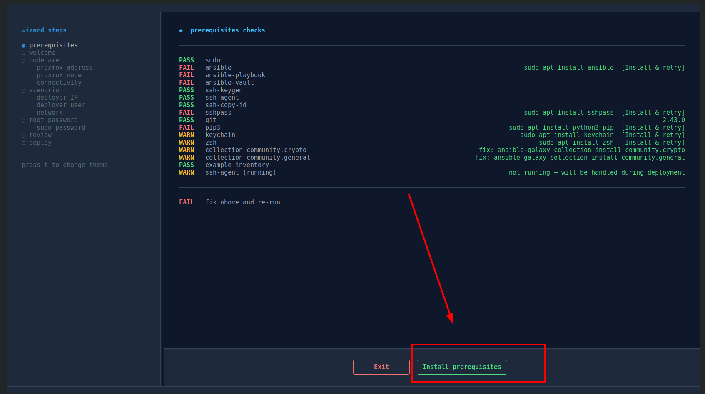
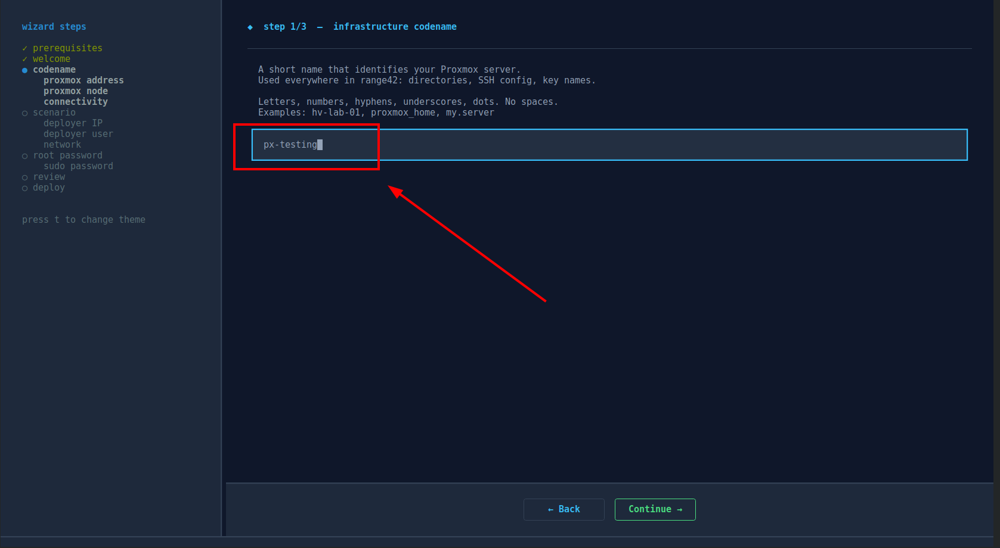
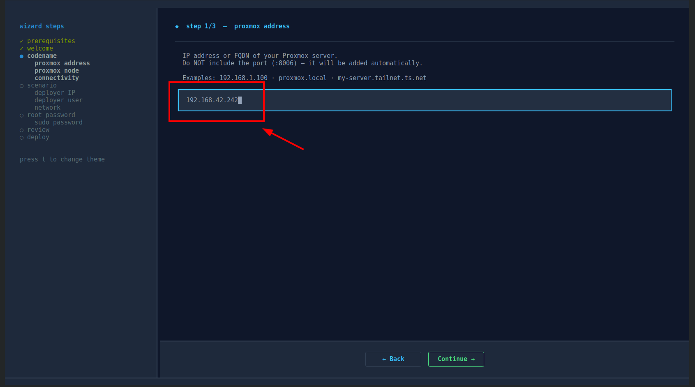
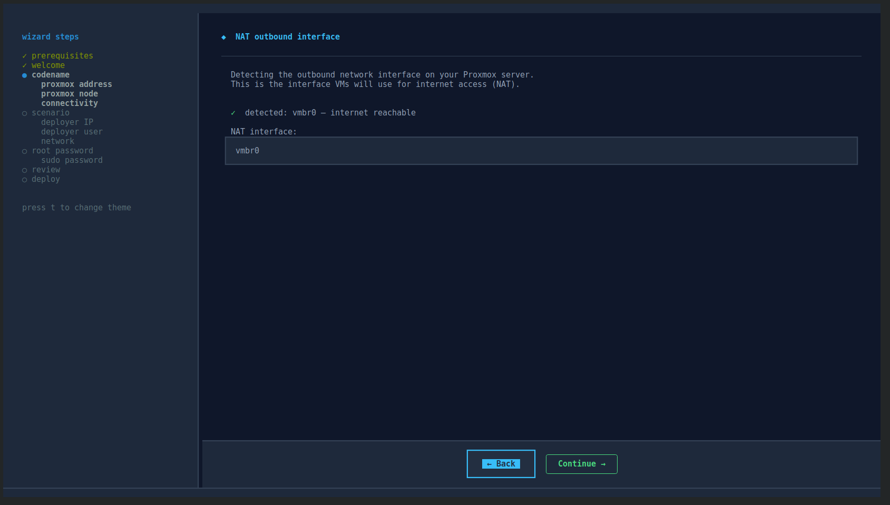
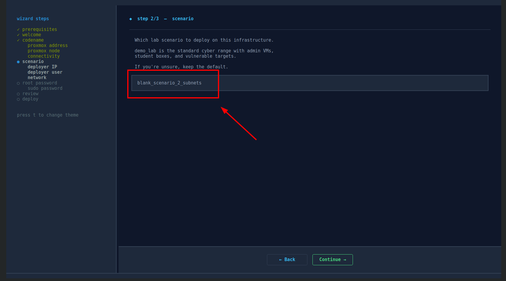

# Getting started with range42

> **⚠ Draft v0.1 - work in progress.**
> This document aims to be the canonical onboarding guide. Screenshots and steps
> may be incomplete. Open an issue or PR for any inaccuracy.

---

## Table of contents

- [Quick glossary](#quick-glossary)
- [What you'll deploy](#what-youll-deploy)
- [Prerequisites](#prerequisites)
- [Fast track - 7 wizard steps](#fast-track--7-wizard-steps)
- [Using range42-context](#using-range42-context)
- [Where credentials live](#where-credentials-live)
- [Deep track - what the wizard does behind the scenes](#deep-track--what-the-wizard-does-behind-the-scenes)
- [What you can do after deploy](#what-you-can-do-after-deploy)
- [Updating range42](#updating-range42)
- [Troubleshooting](#troubleshooting)

---

## Quick glossary

For full definitions, see [GLOSSARY.md](GLOSSARY.md).

| Term | Meaning |
|------|---------|
| **codename** (`INFRASTRUCTURE_CODENAME`) | A label identifying one Proxmox infrastructure (e.g., `mylab`, `production-px-01`). One codename = one Proxmox host or cluster. |
| **scenario** (`INFRASTRUCTURE_SCENARIO`) | A lab definition (which VMs, which networks, which software). Examples: `demo_lab`, `blank_scenario_2_subnets`. One codename can host multiple scenarios. |
| **workspace** | The combination `codename + scenario`. The fundamental unit of range42. Lives at `~/range42.config/<codename>-<scenario>/`. |
| **vault** | An encrypted file (Ansible vault) containing all secrets for a workspace: VM passwords, Proxmox API token, etc. Decryption password is stored next to it in `vault_pass.txt`. |
| **deployer-cli** | The machine where you run range42 commands. Can be your laptop or a dedicated VM. |
| **jump host** | Proxmox itself, used as SSH gateway to reach VMs on isolated bridges. |

---

## What you'll deploy

This guide walks through deploying `blank_scenario_2_subnets` - a minimal network lab with 4 Linux VMs across 2 subnets.

### What is a "blank scenario"?

It's not really a "scenario" in the classical sense (e.g., a CTF, a SIEM lab). 
It's a **clean working base**: a few empty Ubuntu VMs across isolated subnets, ready for you to install whatever you want on top - services, workloads, training material, attack/defense exercises.

Think of it as the cyber-range equivalent of `vagrant up` - you get a working network of VMs in 20 minutes, then it's your playground to build a scenario.

range42 ships 3 blank scenarios:
- `blank_scenario_2_subnets` - 2 subnets, 4 VMs (this guide)
- `blank_scenario_4_subnets` - 4 subnets, 16 VMs
- `blank_scenario_6_subnets` - 6 subnets, 24 VMs

For a full SIEM + CTF cyber range, see `demo_lab` instead (still a work in progress)

### Prerequisites for this guide

- A Proxmox VE 7x or 8.x server you can reach
- Linux operator machine with Python 3.10+
- ~25 minutes of your time (mostly automated)

When done, you'll have:

```
   ┌─────────────────────┐                     ┌──────────────────────────────────┐
   │   deployer-cli      │                     │           Proxmox VE             │
   │   (your machine)    │  ──── SSH/API ────▶ │          (ip_forward=1)          │
   │   range42-context   │                     │                                  │
   └─────────────────────┘                     │  ┌────────┐                      │
                                               │  │ vmbr0  │  → internet (NAT)    │
                                               │  └────────┘                      │
                                               │                                  │
                                               │  ┌─────────────────────────────┐ │
                                               │  │ vmbr143  192.168.143.0/24   │ │
                                               │  │   ├─ bs2-team-143-01  .200  │ │
                                               │  │   └─ bs2-team-143-02  .201  │ │
                                               │  └─────────────────────────────┘ │
                                               │                                  │
                                               │  ┌─────────────────────────────┐ │
                                               │  │ vmbr144  192.168.144.0/24   │ │
                                               │  │   ├─ bs2-team-144-01  .200  │ │
                                               │  │   └─ bs2-team-144-02  .201  │ │
                                               │  └─────────────────────────────┘ │
                                               └──────────────────────────────────┘
```

You SSH into VMs via the Proxmox jump host:

```
deployer-cli  ──ssh──▶  Proxmox jump_user  ──ProxyJump──▶  bs2-team-XXX-XX
```

---

## Prerequisites

### On your local machine (operator workstation)

- Linux (Ubuntu 24.04, Debian 13, similar - fresh install works)
- Python 3.10+
- Network access to your Proxmox (see ports below)

### On the Proxmox server

- One physical interface with internet access (e.g., `vmbr0`)
- Root SSH access enabled (the wizard will install a key automatically)
- Storage `local-lvm` available

### Network ports - operator → Proxmox

The wizard and `range42-context` need these open from your operator machine to the Proxmox host:

| Port | Protocol | Used for |
|------|----------|----------|
| 22 | TCP | SSH (root for bootstrap, jump_user for ProxyJump after) |
| 8006 | HTTPS | Proxmox API (VM lifecycle, network config, etc.) |
| 9200 | HTTPS | Wazuh indexer API (only if you deploy a wazuh-enabled scenario) |

If you're behind a firewall, allow at least 22 + 8006. Port 9200 is only needed if you deploy `demo_lab` (or enable the optional admin infrastructure in a blank scenario) - not for this guide.

---

## Fast track - 7 wizard steps

Total time: ~25 minutes (most of it is automated deploy, you click through in 2 min).

### Step 0 - Clone the repos

```bash
git clone https://github.com/range42/range42.git
git clone https://github.com/range42/range42-playbooks.git
git clone https://github.com/range42/range42-catalog.git
git clone https://github.com/range42/range42-ansible_roles-proxmox_controller.git
git clone https://github.com/range42/range42-ansible_roles-debug-devkit.git
```

What each repo does:

| Repo | Purpose |
|------|---------|
| `range42` | Main repo. Wizard, 11 Ansible roles, 3 playbooks, the `range42-context` shell tool. |
| `range42-playbooks` | Lab scenarios (demo_lab, blank_scenario_*). What gets deployed on the Proxmox VMs. |
| `range42-catalog` | Reusable Ansible roles (firewalls, packages, dotfiles, wazuh, etc.) used by scenarios. |
| `range42-ansible_roles-proxmox_controller` | Wraps the Proxmox API (create/clone/delete VMs, manage templates, networks). |
| `range42-ansible_roles-debug-devkit` | Helper scripts for snapshots, reverts, debugging individual VMs. |

### Step 1 - Launch the wizard

```bash
cd range42
python3 range42-init.py
```



The wizard auto-installs missing dependencies if you accept (textual, ansible, sshpass, keychain).

### Step 2 - Choose "new"


First time setup: pick `◆ new`. If you already deployed a config, you'll see it listed and can overwrite it.

### Step 3 - Enter your infrastructure codename



Pick a label for your Proxmox infrastructure (e.g., `mylab`). This becomes the namespace for everything related to this Proxmox.

### Step 4 - Proxmox connection details



- **Address**: IP or hostname of your Proxmox (e.g., `192.168.1.10`)
- **Node**: Proxmox node name, usually `pve`

The wizard tests reachability before continuing.

### Step 5 - Network (NAT auto-detect + bridge toggles)



- The wizard auto-detects your outbound NAT interface (typically `vmbr0`)
- Bridges `vmbr140` to `vmbr148` are listed with NAT toggle each
- Defaults are fine - accept

### Step 6 - Pick scenario



Type `blank_scenario_2_subnets`.

### Step 7 - Deployer + passwords


- **Deployer-cli IP**: `127.0.0.1` (we run from this machine)
- **Deployer-cli user**: your username
- **Sudo password**: for local apt installs
- **Proxmox root password**: used once to install the SSH root key

The wizard runs the full deployment (~10-15 min). When it finishes:

```bash
source ~/.zshrc           # or open a new terminal
range42-context use mylab blank_scenario_2_subnets
range42-context deploy    # ~15-20 min for first deploy
```

When deploy completes, SSH into a VM:

```bash
ssh r42.bs2-team-143-01
```

You're now `alice@bs2-team-143-01`. From here you can ping the other 3 VMs
(`192.168.143.201`, `192.168.144.200`, `192.168.144.201`) and reach the internet
(NAT routes through `vmbr0`).

> **Note:** range42 generated **both** the Ansible inventory and your `~/.ssh/config`
> for you. SSH keys are loaded automatically when you run `range42-context use`.
> No manual SSH key import or `-i keyfile` flag needed - just `ssh r42.<vm-name>`.

> **Next:** read [Using range42-context](#using-range42-context) below to learn
> the daily-use commands (list, use, inventory, init for adding new scenarios).

---

## Using range42-context

`range42-context` is the daily-use tool. It manages workspaces, switches between
infrastructures and scenarios, deploys/cleans up VMs, and reloads SSH keys.

It's a **shell function** (zsh), sourced from `~/.zshrc`. So `range42-context use`
modifies the current shell - no need to restart, no need to spawn subshells.

### List all your workspaces

A workspace is a `codename + scenario` combination. After step 7 above, you have one.
After multiple `range42-context init` runs, you have several.

```
$ range42-context list

  ── available workspaces ──────────────────────────────────────
  ● [1]  mylab-blank_scenario_2_subnets       range42-context use mylab blank_scenario_2_subnets
  ○ [2]  mylab-demo_lab                       range42-context use mylab demo_lab
  ○ [3]  otherlab-blank_scenario_4_subnets    range42-context use otherlab blank_scenario_4_subnets
```

The active workspace is marked `●`. Inactive workspaces are `○`. The right column shows the exact command to switch to that workspace.

### Switch workspace

```
$ range42-context use mylab demo_lab

  ── switching context ────────────────────────────────────────
   ✓  workspace        : mylab-demo_lab
   ✓  vault password   : ~/range42.config/mylab-demo_lab/secrets/vault_pass.txt
   ✓  ssh keys loaded  : 4 keys
   ✓  ssh include      : ~/.ssh/config_range42-mylab-demo_lab
   ✓  prompt updated   : [mylab/demo_lab]
```

After this, all `range42-context` commands operate on the new workspace.

### Show current workspace

```
$ range42-context current
mylab-demo_lab
```

### Show inventory

Lists all hosts the active workspace will deploy:

```
$ range42-context inventory

@all:
  |--@range42_infrastructure:
  |  |--@r42_admin:
  |  |  |--r42.admin-wazuh
  |  |  |--r42.admin-deployer-api-gateway
  |  |  |--r42.admin-deployer-api-backend
  |  |  |--r42.admin-deployer-ui
  |  |--@r42_admin_wazuh_clients:
  |  |  |--r42.admin-deployer-api-gateway
  |  |  |--r42.admin-deployer-api-backend
  |  |  |--r42.admin-deployer-ui
  |  |--@r42_vuln_box_group:
  |  |  |--r42.vuln-box-00
  |  |  |--r42.vuln-box-01
  |  |  |--r42.vuln-box-02
  |  |  |--r42.vuln-box-03
  |  |  |--r42.vuln-box-04
  |  |--@proxmox:
  |  |  |--mylab
  |  |--@proxmox-cli:
  |  |  |--mylab-cli
```

Useful for sanity-checking what would be deployed before running `deploy`.

### SSH into deployed VMs

`range42-context use` configures **two** things at once:
- Ansible inventory (for `range42-context deploy`)
- SSH config (for `ssh <hostname>` directly)

So once a workspace is active, you can SSH into any deployed VM by name:

```
$ ssh r42.bs2-team-143-01
alice@bs2-team-143-01:~$

$ ssh r42.admin-wazuh
alice@admin-wazuh:~$
```

The hostnames are defined in the auto-generated SSH config:
`~/.ssh/config_range42-<codename>-<scenario>` (included from `~/.ssh/config`).

#### How the SSH jump works

VMs are on isolated bridges (vmbr143, vmbr144, etc.) - your operator machine
has no direct route to them. SSH uses **ProxyJump** through the Proxmox host:

```
   ┌─────────────────┐         ┌──────────────────────┐         ┌───────────────────────┐
   │  your machine   │  ssh    │  Proxmox             │  ssh    │  bs2-team-143-01      │
   │  (operator)     │ ──────▶ │  user: jump_user     │ ──────▶ │  user: alice          │
   │                 │         │  on internet bridge  │         │  on internal vmbr143  │
   │  ssh key:       │         │                      │         │                       │
   │  jump_user key  │         │  (ProxyJump only,    │         │  ssh key:             │
   │  + alice key    │         │  no shell session)   │         │  alice key            │
   └─────────────────┘         └──────────────────────┘         └───────────────────────┘
```

Both keys are loaded into your ssh-agent by `range42-context use`. If they disappear (after reboot), reload them:

```bash
range42-context ssh-reload
```

### Add a new scenario or infrastructure

Use the wizard:

```bash
range42-context init
```

This launches `range42-init.py` again. From there you can:

- **Add a scenario to an existing codename** → pick the codename in step 2, then change the scenario in step 6 (e.g., switch from `blank_scenario_2_subnets` to `demo_lab`)
- **Add a new infrastructure (codename)** → pick "new" in step 2, enter a different codename in step 3

After init completes, the new workspace appears in `range42-context list`.

```
$ range42-context list

  ── available workspaces ──────────────────────────────────────
  ● [1]  mylab-blank_scenario_2_subnets       range42-context use mylab blank_scenario_2_subnets
  ○ [2]  mylab-demo_lab                       range42-context use mylab demo_lab    ← new
```

### Deploy / undeploy the active workspace

```bash
range42-context deploy        # full deploy (templates + VMs + software)
range42-context deploy-vms    # fast redeploy (skip templates)
range42-context delete        # destroy everything + clean SSH known_hosts
range42-context delete-vms    # destroy VMs only (keep templates)
```

### Reload SSH keys

If your ssh-agent loses keys (after reboot, etc.):

```bash
range42-context ssh-reload
```

### Full command list

```
$ range42-context

  ── range42-context ──────────────────────────────────────────
   use <codename> <scenario>      switch active workspace
   list                           list available workspaces
   current                        show active workspace
   status                         show context details
   inventory                      show ansible inventory
   ssh-reload                     reload SSH keys into ssh-agent
   deploy                         deploy scenario VMs
   deploy-vms                     deploy VMs only (skip templates)
   delete                         destroy all VMs and templates
   delete-vms                     destroy VMs only (keep templates)
   init                           launch wizard to add scenario/infra
   debug                          toggle verbose ansible output
```

---

## Where credentials live

range42 generates a lot of secrets at deploy time: SSH keys (4 of them), VM passwords, the Wazuh password, the Proxmox API token. They all live under your workspace, encrypted in an Ansible vault.

### Workspace layout

```
~/range42.config/<codename>-<scenario>/
├── secrets/
│   ├── default_vault.yml          ← encrypted vault (passwords, API token, etc.)
│   ├── vault_pass.txt             ← password to decrypt the vault (chmod 600)
│   ├── vault.view.sh              ← helper: view vault contents
│   ├── vault.edit.sh              ← helper: edit vault
│   ├── vault.create.sh            ← helper: create new vault
│   └── vault.changepwd.sh         ← helper: change vault password
├── ssh_keys/
│   ├── jump_keys/
│   │   ├── px.<codename>-<scenario>-ssh_cli.root         ← Proxmox root SSH key
│   │   └── px.<codename>-<scenario>-ssh_cli.jump_user    ← Proxmox jump user key
│   ├── backend_keys/
│   │   └── r42.<codename>-<scenario>-deployer-key_alice  ← admin user on VMs
│   └── student_keys/
│       └── r42.<codename>-<scenario>-student-key_bob     ← student user on VMs
├── inventory/
│   └── inventory_default.yml      ← ansible inventory (hosts + groups)
├── sourced_range42.sh             ← env vars sourced by range42-context use
└── scenario → ../../range42/range42-playbooks/scenarios/<scenario>/   ← symlink
```

### Where is the vault password?

It's in the workspace, in plain text:

```
~/range42.config/<codename>-<scenario>/secrets/vault_pass.txt
```

This file has `chmod 600` and is owned by your user. It exists by design - this is what allows `range42-context deploy` to run without prompting for the vault password every time.

> ⚠️ This means **anyone with read access to your home directory can decrypt
> the vault**. Don't share `~/range42.config/` or back it up to insecure storage.

### How to view the vault contents

The vault contains generated VM passwords, the Wazuh password, the Proxmox API token. To inspect them:

```bash
cd ~/range42.config/<codename>-<scenario>/secrets/
./vault.view.sh default_vault.yml
```

This wraps `ansible-vault view` and uses `vault_pass.txt` automatically.

To edit:

```bash
./vault.edit.sh default_vault.yml
```

Opens the vault in `$EDITOR`, encrypts on save.

### "I lost my Proxmox root password"

Run `cat default_vault.yml.example` is not it - the example is a template.

If you generated passwords during the wizard, the actual password is **inside the vault**. View it:

```bash
./vault.view.sh default_vault.yml | grep -i password
```

If the wizard didn't generate it (you provided your own), it's not stored anywhere by range42 - only the SSH root key was installed on Proxmox.

### "I lost my SSH keys for the VMs"

The keys live in `~/range42.config/<codename>-<scenario>/ssh_keys/`. As long as you have this directory, you have everything.

If `range42-context use` complains about missing keys, run:

```bash
range42-context ssh-reload
```

If the keys themselves are physically deleted, the simplest recovery is to redeploy:

```bash
range42-context delete
range42-context deploy   # regenerates SSH keys + vault, recreates Proxmox config
```

This is destructive - your VMs will be recreated from scratch.

### "I want to back up everything"

Use `range42-workspace export`:

```bash
range42-workspace export <codename> <scenario>
# → <codename>-<scenario>.r42.tar.gz  (includes secrets, ssh_keys, inventory)
```

Store this tarball somewhere safe (encrypted disk, password manager attachment, etc.). To restore on another machine:

```bash
range42-workspace import <codename>-<scenario>.r42.tar.gz
range42-context use <codename> <scenario>
```

---

## Deep track - what the wizard does behind the scenes

Each wizard step maps to one or more concrete actions on your local machine and on the Proxmox.

### Step 1 (preflight)

**Local machine actions:**
- Check `which ansible ssh-keygen ssh-agent sshpass git keychain zsh`
- Check Ansible collections: `community.crypto`, `community.general`
- Check if `inventories/example/` exists
- Check ssh-agent is running

If anything missing, the wizard either auto-installs (apt) or shows the fix command for you to run manually.

### Step 2 (existing or new)

**Local actions:**
- Scan `inventories/` for existing setups (folders with `hosts.yml`)
- For each, parse `group_vars/` to detect deployed scenarios
- Show one button per `codename + scenario` combination

If you pick "new", an empty inventory will be created. If you pick an existing one, the wizard pre-fills all fields from `group_vars/all/vars.yml`.

### Step 3 (codename)

**Local action:**
- Will create `inventories/<codename>/` from `inventories/example/` template
- All subsequent files (vault, SSH keys, workspace) are scoped under this codename

### Step 4 (Proxmox check)

**Local actions:**
- Test HTTPS reachability to `https://<address>:8006`
- Validate the node name exists in Proxmox API

No changes are made yet - this is read-only verification.

### Step 5 (NAT auto-detect)

**Local actions:**
- SSH to Proxmox as root, run `ip route get 1.1.1.1 | awk '{print $5}'`
- Identify outbound interface (typically `vmbr0`)

**Stored in inventory:**
- `infrastructure_proxmox_default_network_card_interface: vmbr0`
- Per-bridge `nat: true/false` toggle

### Step 6 (scenario)

**Local action:**
- Stored as `INFRASTRUCTURE_SCENARIO` in `group_vars/all/vars.yml`
- Determines which J2 templates the deploy will use

### Step 7 (deployment)

This is where most actions happen. The wizard runs `ansible-playbook site.yml` which executes 3 playbooks in sequence.

#### Playbook 01 - credentials.generate

**Local actions:**
- Generate 4 SSH keypairs (ed25519) in `config/<codename>-<scenario>/ssh_keys/`:
  - `px.<codename>-<scenario>-ssh_cli.root` - Proxmox root SSH
  - `px.<codename>-<scenario>-ssh_cli.jump_user` - Proxmox jump user SSH
  - `r42.<codename>-<scenario>-deployer-key_alice` - admin user on VMs
  - `r42.<codename>-<scenario>-student-key_bob` - student user on VMs
- Generate vault with random VM passwords + Wazuh password
- Encrypt vault with `vault_pass.txt`
- Generate operator's SSH config snippet

#### Playbook 02 - configure proxmox

**Proxmox actions (via root SSH using password from wizard):**
- Install the root SSH key in `/root/.ssh/authorized_keys`
- Create `jump_user` Linux user
- Install Linux locale (en_US.UTF-8)
- Configure NTP

**Proxmox actions (via API token, then via root SSH):**
- Create `range42_api` PAM user
- Generate `range42_api_token` token (auto-recovers if exists with wrong secret)
- Inject token secret into vault
- Create bridges `vmbr140` to `vmbr148` via `pvesh`
- Inject NAT rules per bridge (post-up/post-down iptables MASQUERADE)
- Reload Proxmox network (`ifreload -a`)
- Enable IP forwarding

##### Why a `jump_user` and not just root?

You'll notice range42 creates a separate `jump_user` Linux account on Proxmox, even though it already installed the root SSH key. Two reasons:

1. **Separation of concerns.** Root is used **only once** during bootstrap
   (install the root key, create the jump user, set the API token). After that,
   day-to-day operations (`range42-context use`, `ssh r42.<vm>`) use the API token
   and `jump_user`. Root SSH is no longer needed.

2. **Reduced attack surface for ProxyJump.** A SSH connection through a `jump_user`
   only needs to forward TCP to the internal subnets - it doesn't need a shell.
   Even if the jump key leaks, the attacker has no shell on Proxmox (you can lock
   the user down further with `ForceCommand` or restricted shell if desired).

   Honestly, this doesn't add a huge amount of security on its own - the `jump_user`
   on Proxmox is still a Linux account. But it's a good hygiene practice and lets
   you rotate the jump key without touching root.

#### Playbook 03 - deploy deployer-cli

**Deployer-cli actions (via SSH from your local machine):**
- Install packages: `ansible`, `git`, `keychain`, `oh-my-zsh`, `zsh`, `vim`, etc.
- Configure NTP and locale
- Install dotfiles (vim, zsh)
- Clone all range42 repos to `~/range42/`
- Create workspace at `~/range42.config/<codename>-<scenario>/`
- Upload SSH keys + vault from local machine
- Create symlinks: `scenario →` (in workspace), `secrets →` (in playbook scenario dir)
- Generate two SSH config files from J2 templates:
  - `~/.ssh/config` - adds `Include` for the next file
  - `~/.ssh/config_range42-<codename>-<scenario>` - actual host entries
- Inject `source ~/range42.config/range42-context.sh` into `.zshrc`
- Set the active context to this codename + scenario

After this, `range42-context use <codename> <scenario>` works.

### Step 8 (deploy the scenario itself)

This isn't a wizard step - you run it manually:

```bash
range42-context deploy
```

Which is equivalent to:

```bash
cd ~/range42/range42-playbooks/scenarios/blank_scenario_2_subnets
./blank_scenario_2_subnets.setup.sh
```

**What it does:**

1. Downloads cloud-init images (Ubuntu Noble, Server, Debian 12) to Proxmox storage
2. Creates 9 VM templates (nano, micro, small, medium, large) on `vmbr140`
3. For each of 4 team VMs:
   - Clones template (small, vm_id 9221) to a new VM
   - Sets cloud-init variables (user, password, SSH key, IP, gateway, bridge)
   - Starts the VM
   - Waits for SSH and cloud-init completion
4. On all 4 VMs:
   - Installs basic packages (vim, htop, net-utils)
   - Installs dotfiles for `alice` user
   - Configures UFW firewall (port 22 only)

---

## What you can do after deploy

### Daily operations

```bash
range42-context current        # show active workspace
range42-context list           # all workspaces, active one highlighted
range42-context ssh-reload     # reload SSH keys into ssh-agent
range42-context inventory      # show ansible inventory
range42-context deploy         # deploy scenario VMs
range42-context delete         # destroy all scenario VMs
range42-context delete-vms     # destroy only VMs (keep templates)
```

### Switch scenario or infrastructure

```bash
# add another scenario to same codename
range42-context init                              # wizard
range42-context use mylab demo_lab
range42-context deploy

# add another Proxmox infrastructure
range42-context init                              # new codename
range42-context use otherlab blank_scenario_4_subnets
range42-context deploy
```

### Backup / migrate a workspace

```bash
range42-workspace export mylab blank_scenario_2_subnets
# → mylab-blank_scenario_2_subnets.r42.tar.gz

# on another machine:
range42-workspace import mylab-blank_scenario_2_subnets.r42.tar.gz
range42-context use mylab blank_scenario_2_subnets
```

---

## Updating range42

range42 lives in 5 git repos. To update everything to latest:

```bash
range42-context init     # easiest - the wizard pulls all 5 repos before showing the menu
```

Or manually:

```bash
for repo in range42 range42-playbooks range42-catalog \
            range42-ansible_roles-proxmox_controller \
            range42-ansible_roles-debug-devkit; do
  echo "=== $repo ==="
  cd ~/range42/$repo && git pull
done
```

After updating, you may want to redeploy to apply role/playbook changes:

```bash
range42-context delete-vms      # keeps templates
range42-context deploy-vms      # redeploy with new code (~5 min)
```

If a role under `~/range42/range42/roles/` changed (e.g., `deployer.bootstrap`),
run the full `site.yml` again via `range42-context init` to rebuild the
deployer-cli config.

---

## Troubleshooting

### The fast way - use range42-context

Most issues with stale state (failed deploy, partial cleanup, IP/key conflicts) can be fixed by tearing down and redeploying. After `range42-context use <codename> <scenario>`:

```bash
# full reset (deletes templates + VMs + SSH known_hosts, then redeploys)
range42-context delete
range42-context deploy

# faster reset (keeps templates, recreates VMs only)
range42-context delete-vms
range42-context deploy-vms
```

This handles 90% of issues automatically - start here before deep-diving.

### What's happening behind the scenes

If you want to understand what's actually breaking before running `delete`:

**Wizard fails on preflight**
Missing local dependencies. Install the apt packages shown by the wizard.
The wizard checks: `ansible`, `ssh-keygen`, `ssh-agent`, `sshpass`, `git`, `keychain`, `zsh`,
plus Ansible collections `community.crypto` and `community.general`.

**Proxmox check fails**
The wizard couldn't reach `https://<address>:8006`. Verify manually with
`curl -k https://<address>:8006`. Common causes: wrong IP, firewall, Proxmox not running.

**Deploy fails on `vm_create` "already exists"**
Templates (vm_id 9211-9248) exist from a previous deploy. The proxmox controller
auto-skips them - just re-run. If the failure persists, run `range42-context delete`
to remove leftover state.

**SSH "REMOTE HOST IDENTIFICATION HAS CHANGED"**
The IP was previously used by a different VM with a different SSH host key.
The `delete` and `delete-vms` commands handle this by running:

```bash
~/range42/range42-playbooks/scenarios/blank_scenario_2_subnets/blank_scenario_2_subnets.reset.ssh_keys.sh
```

You can run this script directly if you only want to reset known_hosts without redeploying.

**Deploy fails on `chattr` errors during SSH key generation**
Already fixed in current version. Pull latest from range42 repo. The fix removes
`attributes: ""` from `openssh_keypair` which was failing on virtio/qcow2 disks.

**Vault corrupted or unable to decrypt**
The simplest recovery is to redeploy the VMs (the vault itself is regenerated
during deploy, and the SSH keys it references are also regenerated):

```bash
range42-context delete-vms
range42-context deploy-vms
```

This keeps the Proxmox templates (no need to re-download cloud images) but recreates everything else, including a fresh vault.

If the vault is intact but you can't view it, check `vault_pass.txt` exists in the same `secrets/` directory and is readable.

**Wazuh / admin VMs**
This guide deploys `blank_scenario_2_subnets` which **supports** the admin infrastructure (wazuh server + deployer platform on `vmbr142`). It's currently
**disabled by default** because not fully tested. To enable, edit `scenarios/blank_scenario_2_subnets/main.yml` and uncomment the `01_admin_infrastructure/_main.yml` import (and the related blocks in that file).

---

> **⚠ Draft v0.1 - work in progress.**
> Screenshots are placeholders. Some flows may have changed since this was written.
> Refer to the wizard text on screen as the source of truth.
> Issues / corrections: open an issue on the range42 repo.
