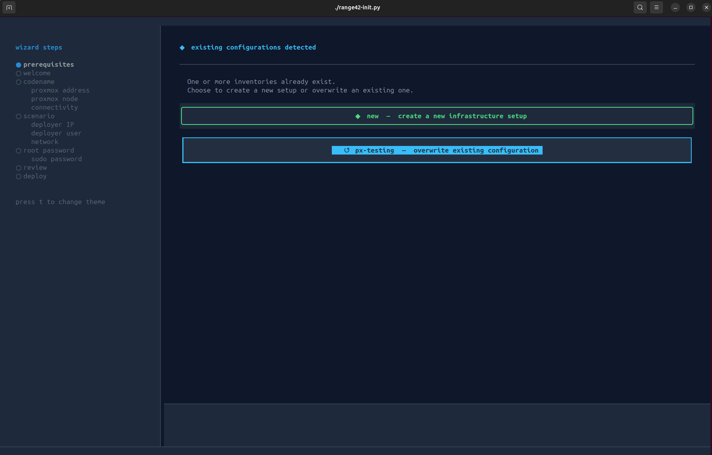

# RANGE42

**range42** is a modular cyber range platform based on Proxmox + Ansible for deploying reproducible offensive, defensive and hybrid training environments.
One operator workstation can manage multiple Proxmox infrastructures, each running multiple lab scenarios. Everything is infrastructure-as-code.

Start with [GETTING_STARTED.md](GETTING_STARTED.md) for a hands-on walkthrough, or browse the [GLOSSARY](GLOSSARY.md) for terminology (codename, scenario, workspace, jump host, etc.).

## Table of contents

- [Start here](#start-here)
  - [Quick start](#quick-start)
  - [Supported platforms](#supported-platforms)
  - [Daily operations](#daily-operations)
- [About the project](#about-the-project)
  - [Who it's for](#who-its-for)
  - [Architecture overview](#architecture-overview)
  - [Networks and firewall](#networks-and-firewall)
  - [The stack](#the-stack)
  - [Project mid / long term goals](#project-mid--long-term-goals)
  - [Extend the scenarios](#extend-the-scenarios)
  - [Glossary](#glossary)
  - [Authors](#authors)

---

# Start here

## Quick start

The recommended way to deploy range42 is the setup wizard:

```bash
sudo apt-get update ; apt-get upgrade -y
sudo apt-get install python3-venv git
mkdir -p $HOME/range42 && cd $HOME/range42
git clone https://github.com/range42/range42.git
cd range42
./range42-init.py
```



The wizard walks you through preflight checks, Proxmox connection, network configuration (SDN networks by default, outbound NAT per network, an optional ssh whitelist for the lab VMs) and the full deployment.

For the complete walkthrough (prerequisites, every wizard step explained, SSH access, daily operations, troubleshooting), see [GETTING_STARTED.md](GETTING_STARTED.md).

If you'd rather drive the playbooks yourself, see [Manual setup (advanced)](GETTING_STARTED.md#manual-setup-advanced).

## Supported platforms

range42 is developed and tested on Ubuntu LTS (Desktop / Server) and is also expected to work on Debian 13. Full details and prerequisites:
[GETTING_STARTED.md - Prerequisites](GETTING_STARTED.md#prerequisites).

## Daily operations

Once deployed, you manage your lab with the `range42-context` shell tool (switch workspaces, deploy / undeploy, SSH into VMs, view credentials, etc.). The full reference is in
[GETTING_STARTED.md - What you can do after deploy](GETTING_STARTED.md#what-you-can-do-after-deploy).

---

# About the project

## Who it's for

- **Sysadmins** - practice securing vulnerable stacks and test hardening procedures
- **SOC analysts / blue teams** - validate detection rules, tune alerts, test incident response
- **Red teamers / researchers** - build exploit chains, study CVEs in controlled environments
- **Forensics teams** - reconstruct incidents, analyse compromised systems

## Architecture overview

A range42 deployment can be driven in two complementary ways:

**Web UI path** (visual, recommended for day-to-day operations):

```
  ┌─ range42-deployer-ui (Vue 3 + VueFlow) ──────────────────┐
  │  Visual topology canvas — drag-and-drop lab design        │
  └──────────────────────────┬───────────────────────────────┘
                             │ REST + WebSocket
  ┌──────────────────────────▼───────────────────────────────┐
  │  range42-api-gw (Kong gateway)                           │
  │  Auth, ACLs, rate-limiting                               │
  └──────────────────────────┬───────────────────────────────┘
                             │
  ┌──────────────────────────▼───────────────────────────────┐
  │  range42-backend-api (FastAPI)                           │
  │  80 REST endpoints + /ws/status stream                   │
  └──────────┬───────────────────────┬───────────────────────┘
             │                       │
  range42-playbooks          range42-catalog
  (scenarios + bundles)      (roles, Docker, CTF content)
             │
             ▼
  [ Proxmox VE cluster ]
  VMs, LXC, networks
```

**CLI path** (direct, for advanced/scripted use):

```
  [ deployer-cli (range42-context) ]
     │
     ├─ runs the setup wizard
     ├─ holds inventory + credentials
     └─ drives Ansible playbooks directly
             │
             ▼
  [ Proxmox VE cluster ]
  VMs, LXC, networks
```

Both paths converge on the same Proxmox infrastructure and Ansible playbooks — the web UI simply adds a visual layer and a managed API on top.

The **deployer-cli** is your local machine by default, or a dedicated pivot VM if you manage multiple Proxmox infrastructures from one place.

Today, the **lab VMs on Proxmox** are generally organised into 3 host groups (this is the convention used by current scenarios and may evolve as new ones are added):

| Group | Purpose | Required |
|-------|---------|----------|
| **Lab systems** | The systems of the exercise : team workstations of the blank scenarios, vulnerable targets of the CTF labs, the product of a product lab | Yes |
| **Administration** | Monitoring, orchestration, supervision | No |
| **Student / Training** | Workstations for learners | No |

Only the lab systems are required. The admin VMs are off by default and switched on one by one with feature flags (`INSTALL_WAZUH`, `INSTALL_MISP`...), the student group is optional.

## Networks and firewall

The lab networks are **Proxmox SDN** objects : one zone per host, one vnet per lab subnet (`net142` for the admin tier, `net143`, `net144`... for the teams, `net140` for the template builds), created once at init and declared by each scenario in its `00_sdn_bootstrap/_main.yml`. Outbound NAT is a per-network toggle of the init. The **Proxmox firewall** is wired at every deployment : anti-lockout accepts on the datacenter and the node, an ssh accept on every VM, and an arming that stays opt-in.

```bash
range42-context networks-show-sdn                # zone, vnets, subnets, NAT, isolation of the active scenario
range42-context networks-internet-list           # declared vs live egress, per network
range42-context networks-internet-off            # cut the egress of the scenario networks (networks-internet-on restores it)
range42-context networks-show-firewall --rules   # datacenter, node and per-VM switches, then the rules and what is in force
range42-context networks-firewall-on             # arm the guests of the scenario (networks-firewall-off disarms)
```

Every gesture takes a scope (`--roles`, `--vnet` or `--cidr` for the egress pair, `--scope` for the firewall pair and the views) and `--yes` to skip its confirmation ; `range42-context help` lists them all, and `range42-context --tui` offers the same gestures in a dashboard.

At init, the ssh accept of the lab VMs can be restricted to addresses of your choice : it is the Proxmox firewall of each VM, not the firewall inside the VM, and every network of the scenario stays allowed so the deployer never locks itself out. Details in [GETTING_STARTED.md](GETTING_STARTED.md#networks-and-firewall).

## The stack

In its recommended configuration, range42 relies on:

- **Proxmox** - hypervisor for virtual machines (mandatory)
- **Ansible** - provisioning and orchestration (mandatory)
- **Docker / LXC** - containerized services and vulnerable stacks (recommended)
- **Wazuh** - security monitoring and detection (optional)
- **Firewalls / VPN** - network segmentation and access control (recommended)
- **Proxmox SDN + Proxmox firewall** - lab networks as SDN vnets, hypervisor-side segmentation armed on demand (the default of the init)
- **Vue.js / FastAPI / Kong** - web UI and API layer (available)

## Project mid / long term goals

The goal is to cover the full spectrum of cyber training. Here's where the project stands today and where it's heading.

**Status legend:** **shipping** = production-tested · **early** = working, content to grow · **partial** = code in place, currently disabled · **planned** = on the roadmap

| Use case | Status | What range42 brings |
|----------|--------|---------------------|
| **Network labs** | shipping | Empty multi-subnet bases (`blank_scenario_2/4/6_subnets`) ready for you to install your own workloads on top |
| **Product labs** | shipping | Standalone MISP, Gitea, Mattermost, Nextcloud and Rocket.Chat servers and the Kunai detection workshop, one scenario each (`misp_lab`, `gitea_lab`, `mattermost_lab`, `nextcloud_lab`, `rocketchat_lab`, `kunai_lab`) |
| **Defensive training** | shipping | Wazuh-instrumented infrastructure via `demo_lab`, ready for detection-engineering and rule-tuning exercises |
| **Offensive training** | early | Vulnerable hosts and misconfigured services in `demo_lab`, sixteen CVE and misconfiguration containers as bundles (`range42-playbooks/bundles/ctf`) ; the catalogue grows with each release |
| **Student workstations** | partial | Group structure in place; the `03_student_infrastructure` block is currently disabled and **will** be re-enabled once stabilised |
| **Hybrid (red / blue)** | planned | One lab, both perspectives, scoreboard and full visibility on both sides |
| **Forensics & IR** | planned | Reproducible compromised environments for rebuild-and-investigate exercises |

## Extend the scenarios

All deployable scenarios live in [range42-playbooks/scenarios](https://github.com/range42/range42-playbooks/tree/main/scenarios) - the list will grow over time.

The reusable building blocks (CVEs, misconfigured services, product setups, Ansible roles) live in the [range42-catalog](https://github.com/range42/range42-catalog) repository.

**Want a specific product, CVE or misconfiguration added?** Open an issue on the [range42-catalog](https://github.com/range42/range42-catalog/issues) repo - we centralise catalog requests there.

**Found a bug or have a feature request for range42 itself?** Open an issue on the [range42](https://github.com/range42/range42/issues) repo (anything not related to the catalog goes here).

We'll prioritise as fast as we can.

## Glossary

See [GLOSSARY.md](GLOSSARY.md) for all terminology: codename, scenario, workspace,
deployer-cli, jump host, vault, context, range42-context, SDN zone and vnets, firewall arming, host groups, inventory.

## Authors

range42 is built and maintained by:

| Name | Company / Affiliation | Website |
|------|----------------------|---------|
| Benjamin Collas | DIGISQUAD | [digisquad.com](https://www.digisquad.com) |
| Philippe Parage | NC3 | [nc3.lu](https://nc3.lu/) |

See AUTHORS file for the full list of contributors.
